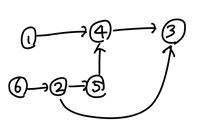

# 백준 사이트 문제 풀이

## Q17298

<details>
<summary>오큰수</summary>

- 링크 : https://www.acmicpc.net/problem/17298
- 풀이 방법
  - 스택과 우선순위 큐를 사용해서 풀었다.
  - 앞에서부터 숫자를 읽어오면서 스택이 비어있을 경우 스택에 해당 index를 push해주고, 그 다음 숫자를 읽는다.
  - 이때, 스택의 제일 윗 숫자와 그 다음 숫자를 비교해서 만약 스택의 제일 윗 숫자가 더 작다면 pop()을 해준 뒤 우선순위 큐에 (stack에서 pop된 index, 읽어온 숫자)를 넣어준다.
  - 위 과정을 반복한다.
  - 위 과정이 끝난 후, (stack에 남아 있는 인덱스,-1)를 우선순위 큐에 넣어준다.
  - 그 후, 우선순위 큐를 꺼내면서 값을 출력한다.(인덱스 우선)
- 더 좋은 방법
  - stack안에는 해당 값의 index가 들어가야한다. 처음 입력했을 때 몇번째 index에 위치한 값인지를 넣어야 한다는 말이다. 다시 주어진 예제를 본다면 3 5 2 7에서 처음에 3의 index인 0을 push하고 5에 해당하는 index 1을 넣어줄 때에는 결과 리스트의 index 0에 해당하는 값을 5로 바꿔주고 stack에서는 pop시킨 후에 5에 해당하는 index 1을 push해주면 된다.
  
    ```python
    import sys 
    N = int(sys.stdin.readline()) 
    input = list(map(int, sys.stdin.readline().split()))
    stack = [] 
    result = [-1 for _ in range(N)] 
    stack.append(0) i = 1 
    while stack and i < N: 
        while stack and input[stack[-1]] < input[i]: 
            result[stack[-1]] = input[i] 
            stack.pop() 
        stack.append(i) 
        i += 1 
    for i in range(N): print(result[i], end = " ")
    ``` 
  - 출처: https://suri78.tistory.com/49 [공부노트]

</details>

---

## Q1655

<details>
<summary>가운데를 말해요</summary>

- 링크 : https://www.acmicpc.net/problem/1655
- 풀이 방법
  - 우선순위 큐를 사용하여 중간 값을 기준으로 낮은 값은 max_heap으로 저장하고, 큰 값은 min_heap으로 저장한다. 이때, max_heap의 root가 중간 값으로 생각한다.
  - 새로운 데이터를 push할때 max_heap과 min_heap의 원소 개수가 다르면 max_heap에 넣고, 그 외에는 min_heap에 넣어준다.
  - 그 후, 각각의 heap에의 root를 비교해서 이때 max_heap(즉 left)가 min_heap(즉 right)보다 클 경우 서로의 원소를 바꿔서 저장한 뒤, max_heap의 root를 출력하면 된다.
  <br/>
  

</details>

---

## Q1300

<details>
<summary>K번째 수</summary>

- 링크 : https://www.acmicpc.net/problem/1300
- 풀이 방법
  - K번째의 숫자를 알아야한다.
  - 이분탐색으로 mid보다 낮은 숫자의 개수를 알아낼 수 있다.
    - 각 row에서 mid보다 낮은 숫자의 개수는 mid//i(이때 i는 1~N)이다.
    - 이 모든 개수를 더하면 mid라는 숫자는 몇번째 위치한지 알 수 있다.
  - 이때, 개수가 같은 숫자가 있을 수 있는데 이때는 최솟값을 찾아야 하므로 result에 mid를 저장한 다음 end = mid - 1 해서 계속 진행한다.
- Binary Search가 끝나면 result를 출력한다.

</details>

---

## Q1753

<details>
<summary>최단경로</summary>

- 링크 : https://www.acmicpc.net/problem/1753
- 풀이 방법
  - 최단경로를 구하는 알고리즘은 대표적으로 플로이드-워셜 과 다익스트라가 있다. 
    - 이 둘의 차이점은 <br/>
    플로이드-워셜의 경우 '모든 지점에서의 다른 모든 지점까지의 최단 경로'를 구할때 사용하며, graph[a][b] = w 이런식으로 배열을 사용하며, *O(N<sup>3</sup>)*이다.<br/>
    다익스트라의 경우 '시작 지점(한 지점)에서의 다른 모든 지점까지의 최단 경로'를 구할때 사용하며, graph[a].append((b,w)) 이런식으로 리스트를 사용하며, *O(ElogV)*이다.
  - 문제에서는 '시작 지점에서 다른 모든 지점까지의 최단 경로'를 구해야하므로 다익스트라를 이용하여 문제를 풀었다.
  - 다익스트라 구현
    - 변수 키워드
      - graph[a].append((b,w)), distance = [INF] *(N+1), heapq(우선순위 큐)
      - 처음으로, 우선순위 큐에 (0,start)를 넣는다.(자기 자신의 거리는 0)
      - 그 후, q가 빌때까지 while문을 돌면서 우선순위 큐에서 꺼낸 원소(dist,now)와 연결된 노드들의 거리들을 체크한다.
        - 현재 distance[next[0]](즉, start에서 next[0]까지의 직진 거리 혹은 그 전에 저장되어 있던 최소 비용 거리)와 cost(즉,dist + next[1], 돌아가서 가는 거리(now...next))를 비교하여 cost가 더 적을경우 distance[next[0]]에 대입 후 우선순위 큐에 (cost,해당 노드 번호)를 넣어준다.

</details>

---

## Q17144

<details>
<summary>미세먼지 안녕!</summary>

- 링크 : https://www.acmicpc.net/problem/17144
- 풀이 방법
  - 전형적인 구현 문제이다.
    - python3로 돌리면 시간초과가 뜨고, pypy로 돌리니까 통과했다.
  - 커다란 로직은 아래와 같다.
    - 미세먼지확산() <br/>
    공기청정기 작동() <br/>
    - 이렇게 위 작동이 1초
    - 이걸 T초 동안 돌리자
  - 각각의 함수의 로직들은 문제에 나와있으므로 그걸 그대로 구현했다.
  - move_dirty() == 미세먼지확산()
    - 이 같은 경우 주어진 graph의 원소를 하나씩 검사하면서 먼지가 있다면, 4방향을 검사하며 이때 퍼질 수 있는 방향을 세어야하며, 만약 퍼질 수 있다면 rem[nx][ny]에 퍼지는 양(==diffusion)을 더해준다.
    - 모든 원소를 마무리하면 graph에 rem을 옮겨준다.
  - air_cleaner() == 공기청정기 작동()
    - 위에는 반시계, 아래는 시계 방향으로 옮겨주어야한다.
    - 나같은 경우 옮기기 위해 rem이라는 큐를 선언 후 0(기계에서 나온 공기)를 넣은 후, 옮겨갈 다음 좌표를 큐에 넣고 해당 좌표에다가 큐를 pop()한 값을 넣음으로써 회전시켰다.

</details>

---

## Q1967

<details>
<summary>트리의 지름</summary>

- 링크 : https://www.acmicpc.net/problem/1967
- 풀이 방법
  - 주어진 트리의 root에서 bfs()를 시도하여 가장 최장 거리에 있는 노드 번호를 찾는다.
  - 그 후, 최장 거리에 있는 노드로 부터 다시 bfs()를 시도하여 가장 거리가 먼 값을 출력하면 트리의 지름이 가장 길다고 할 수 있다.
  - bfs를 할때 자기자신->노드->자기자신의 길이가 가장 큰 값을 가질 경우 잘못된 값이 나오므로 visited을 따로 두어 이러한 경우를 방지한다.

</details>

---

## Q1916

<details>
<summary>최소비용 구하기</summary>

- 링크 : https://www.acmicpc.net/problem/1916
- 풀이 방법
  - 하나의 노드에서 다른 노드까지의 최소 비용을 구하는 문제이므로 다익스트라 알고리즘을 이용하여 해결하였다.
  - 주어진 start 노드로 다익스트라 알고리즘을 돌린 후, start 노드에서 다른 모든 노드들까지의 최소 비용이 구해진 distance 리스트에서 distance[end]를 출력해주면 start->end의 최소 비용을 구할 수 있다.

</details>

---

## Q1043

<details>
<summary>거짓말</summary>

- 링크 : https://www.acmicpc.net/problem/1043
- 풀이 방법
  - 문제에서 '당연히, 어떤 사람이 어떤 파티에서는 진실을 듣고, 또다른 파티에서는 과장된 이야기를 들었을 때도 지민이는 거짓말쟁이로 알려지게 된다. 지민이는 이런 일을 모두 피해야 한다.' 라는 말을 보고 Disjoint Set(서로소 집합)을 통해 문제를 해결해야겠다는 생각을 했다.
  - 각각의 파티에 참여하는 사람들을 같은 그룹으로 묶은 후(Disjoint Set), 진실을 알고 있는 사람들의 번호도 아까 과정에서 형성된 parent를 이용해 find 연산을 통해 번호를 root로 바꿔준다.
  - 그 후, 각각의 파티의 사람들을 보며 진실을 알고 있는 그룹인 known_people안에 해당 root를 가지고 있으면(== 같은 그룹이면) 그 파티는 과장된 이야기를 할 수 있는 파티가 아니므로 제외해서 수를 세야한다.

</details>

---

## Q1238

<details>
<summary>파티</summary>

- 링크 : https://www.acmicpc.net/problem/1238
- 풀이 방법
  - 각각의 학생들의 왕복하는 길의 최단 시간을 구해야한다. 그러므로 start 노드 -> 다른 모든 노드의 최단 거리를 구해야하므로 다익스트라를 떠올렸다.
  - 하지만, 왕복이므로 'start 노드 -> 다른 모든 노드'와 다른 모든 노드 -> start 노드' 이 2개의 최단 거리를 모두 알아야 왕복의 최단 거리를 알 수 있다.
  - 이를 해결하고자, 주어진 그래프와 주어지는 그래프의 역방향 그래프를 만들어 각각 start 노드에서 다익스트라 알고리즘을 수행하여 만들어지는 distance 리스트 2개를 더하여 가장 큰 값을 출력하면 'N명의 학생들 중 오고 가는데 가장 많은 시간을 소비하는 학생은 누구일지 구하여라.'를 구할 수 있다.

</details>

---

## Q15663

<details>
<summary>N과 M (9)</summary>

- 링크 : https://www.acmicpc.net/problem/15663
- 풀이 방법
  - 'N개의 자연수 중에서 M개를 고른 수열'를 구하는 것이므로 from itertools import permutations를 이용하여 구한 뒤 해당 값을 정렬 후 출력하였다.

</details>

---

## Q15650

<details>
<summary>N과 M (2)</summary>

- 링크 : https://www.acmicpc.net/problem/15650
- 풀이 방법
  - '1부터 N까지 자연수 중에서 중복 없이 M개를 고른 수열'이므로 from itertools import combinations를 이용하여 구한 뒤 출력하였다.
  - 1~N까지의 리스트를 만든 후 combinations(리스트,M)을 한 뒤 해당 내용을 출력하면 된다.

</details>

---

## Q1504

<details>
<summary>특정한 최단 경로</summary>

- 링크 : https://www.acmicpc.net/problem/1504
- 풀이 방법
  - 1번 노드에서 시작하여 주어진 두 정점을 거치면서 N번 노드로 가는 최단 경로를 가야하므로 다익스트라를 떠올렸다.
  - 1번노드 에서 두 정점 v1,v2를 거쳐 N번 노드로 가는 최단 경로는 두가지 경우가 나온다.
    - 1 → v1 → v2 → n
    - 1 → v2 → v1 → n
  - 다익스트라 알고리즘은 start node에서 다른 모드 노드까지의 최단 경로를 구하므로 이에 대한 최소 비용을 저장한 distance 리스트를 가지고 구할 수있다.
  
    ```python
    one = dijkstra(1)
    ```
    ```python
    rem_v1 = dijkstra(v1)
    ```
    ```python
    rem_v2 = dijkstra(v2)
    ```
    - one 은 '1에서 다른 모든 노드로 가는 최소 비용'이 저장된 리스트이다.
    - rem_v1 은 'v1에서 다른 모든 노드로 가는 최소 비용'이 저장된 리스트이다.
    - rem_v2 는 'v2에서 다른 모드 노드로 가는 최소 비용'이 저장된 리스트이다.
  - 위에서 구한 리스들로 1에서 출발하여 v1,v2를 거쳐 n으로 가는 최소비용을 구할 수 있다.
    ```python
    result = min(one[v1]+rem_v1[v2]+rem_v2[N],one[v2]+rem_v2[v1]+rem_v1[N])
    print(result if result < INF else -1)
    ``` 

</details>

---

## Q2263

<details>
<summary>트리의 순회</summary>

- 링크 : https://www.acmicpc.net/problem/2263
- 참고 : https://whereisend.tistory.com/112
- 풀이 방법
  - 문제에서 주어진 inorder와 postorder를 바탕으로 preorder를 구해야한다.
  - preorder는 VLR(value-left-right)형식으로 순회하며 즉 해당 트리의 root를 먼저 도착한다.
  - 그러므로, print(root) → left_tree → right_tree로 진행해야하며, 각각의 트리(부분 트리)들을 순회할때 그에 맞는 inorder의 부분트리와 postorder의 부분트리도 알기위해 변수로 해당 트리의 inorder start, end 와 postorder start, end를 주었다.
  - 

</details>

---

## Q17070

<details>
<summary>파이프 옮기기1</summary>

- 링크 : https://www.acmicpc.net/problem/17070
- 풀이 방법
  - 주어진 조건에 맞춰 bfs를 수행하며 큐를 pop했을때 x2,y2 좌표가 N-1,N-1일때 result를 올려 bfs가 끝나면 result를 출력한다.
  - 하지만, 이러한 방식으로 완전탐색으로 할 경우 파이썬의 경우 시간초과가 발생하며, c++ 경우 통과가 된다.
  - 찾아보니 파이썬에서 문제를 통과하기위해서는 dp로 풀어야한다.
  - dp는 나중에 풀어보겠음.
  - python 코드를 c++로 변경하는 방법도 알 필요가 있다는 것을 깨닫는 문제였다.
  - 

</details>

---

## Q11725

<details>
<summary>트리의 부모 찾기</summary>

- 링크 : https://www.acmicpc.net/problem/11725
- 풀이 방법
  - 트리의 root가 1이므로 1번 노드부터 bfs로 탐색하면서 연결된 노드들의 parent를 visited 리스트에 저장한 뒤 출력하면 된다.

</details>

---

## Q1991

<details>
<summary>트리 순회</summary>

- 링크 : https://www.acmicpc.net/problem/1991
- 풀이 방법
  - 그래프를 dictionary 자료형을 이용하여 만들었다.
    ```python
    N = int(input())
    graph = {}
    for i in range(N):
        a,b,c = input().split()
        graph[a] = graph.get(a,[]) + [b]
        graph[a] = graph.get(a, []) + [c]
    ```
    
  - preorder, inorder, postorder는 재귀적으로 함수를 구성했으며 종료조건으로는 node가 '.'일 경우 종료하도록 했다.
  - preorder → VLR(value-left-right)
  - inorder → LVR(left-value-right)
  - postorder → LRV(left-right-value)

</details>

---

## 18119

<details>
<summary>단어 암기</summary>

- 링크 : https://www.acmicpc.net/problem/18119
- 풀이 방법
  1. 처음에는 생각나는대로 주어진 단어에 잊어버린 단어가 있는지 확인하는 형태의 naive한 코드를 짠 후 시도했으나 TLE
  ```python
  import sys
  input = sys.stdin.readline

  N, M = map(int,input().split())
  words = [input() for _ in range(N)]

  forget = []

  for i in range(M):
      num, word = input().split()
      answer = 0
      if num == '1':  # 잊어버리기
          forget.append(word)
          for j in words:
              check = False
              for k in forget:
                  if k in j:
                      check = True
                      break
              if check == False:
                  answer += 1
          print(answer)
      else:   # 기억해내기
          forget.remove(word)
          for j in words:
              check = False
              for k in forget:
                  if k in j:
                      check = True
                      break
              if check == False:
                  answer += 1
          print(answer)
  ``` 
  2. 주어진 문자열에 잊어버린 문자가 있는지 확인하는데 시간이 오래 걸렸나 싶어 이분탐색으로 이를 탐색하여 확인해봄 -> TLE
  ```python
  from bisect import bisect_left, bisect_right

  # 값이 [left_value,right_value]인 데이터의 개수를 반환하는 함수
  def count_by_range(a, left_value, right_value):
      right_index = bisect_right(a,right_value)
      left_index = bisect_left(a,left_value)
      return right_index - left_index

  N,M=map(int,input().split())
  words = [list(input()) for _ in range(N)]
  for word in words:
      word.sort()
  forget = []
  #print(count_by_range(a,5,5))
  for i in range(M):
      num, fg = input().split()
      answer = 0
      if num == '1':  # 까먹기
          forget.append(fg)
          for word in words:
              check = False
              for f in forget:
                  if count_by_range(word,f,f) !=0:
                      check = True
              if check == False:
                  answer+=1
          print(answer)
      else:   # 기억
          forget.remove(fg)
          for word in words:
              check = False
              for f in forget:
                  if count_by_range(word,f,f) !=0:
                      check = True
              if check == False:
                  answer+=1
          print(answer)
  ```
  3. 비트마스킹으로 해결
    - alpha 리스트는 'a'가 0번째, 'z'가 25번째 인덱스이며 주어진 문자열에서 각각의 문자열에서 해당 문자를 가질 경우 주어진 문자열이 나온 순서 index를 alpha[해당 문자 순서]에 추가해준다.
      ```python
      alpha = [[] for _ in  range(26)]
      for i in range(N):
          words = set(input())
          for word in words:
              alpha[ord(word)-ord('a')].append(i)
              print(word,ord(word)-ord('a'))
      ``` 
      - ex>문제 예제에서 처음 주어진 'apple'의 경우, 'a'==0, 'p'==15, 'l'==11,'e'==4이다. 그러므로 alpha[0]=[0], alpha[15]=[0],alpha[11]=[0],alpha[4]=[0]이 된다.<br/> 두번째로 주어진 actual의 경우 'a'==0,c=='2',t=='19','u'==20,'l'==11이다. 그러므로 첫번째 문자열의 결과를 포함해서 alpha리스트를 나타내면 alpha[0]=[0,1],alpha[2]=[1],alpha[4]=[0],alpha[11]=[0,1],alpha[15]=[0],alpha[19]=[1],alpha[20]=[1]가 된다.
    - check 리스트는 주어진 문자열에서 까먹은 자음의 개수가 몇개인지를 나타내는 리스트이다.
    - answer의 경우 처음에는 문자를 전부 알고 있으므로 주어지는 문자열의 개수인 N개만큼 문자열을 알고있다.
      - 그러나, 문자열을 까먹거나 기억해내는 행동을 할 때마다 이러한 answer에서 + 혹은 -가 된다. 즉, 행동 하나할때마다 answer 값의 변화가 일어나고 그 값을 출력해주면 된다.
    - 까먹을경우 해당 알파벳을 가지고 있는 문자열을 알기 위해서 alpha 리스트를 이용한다. 이때, 해당 문자열이 만약 잊어버린 문자가 없는 상태(check[i]==0)일 경우, 문자를 까먹어버렸으니 answer-=1하여 알고 있는 문자 개수를 줄여준 뒤 check[i]+=1을 하여 해당 문자열에서 모르는 문자 개수를 추가해준다.
      ```python
      if o == '1':    # 까먹음
      for i in alpha[ord(x)-ord('a')]:
          if check[i] == 0:
              answer-=1
          check[i]+=1
      ```
     - 기억해낸 경우도 까먹은 경우와 마찬가지이다. 그러나 기억을 해냈으므로 까먹은 경우와 다르게 먼저 check[i]-=1을 해준 뒤 check[i]==0일 경우 answer+=1일 해주면 된다.
     ```python
    else:   #기억해냄
      for i in alpha[ord(x)-ord('a')]:
          check[i] -= 1
          if check[i] == 0:
              answer +=1
     ```

</details>

---

## Q9184

<details>
<summary>신나는 함수 실행</summary>

- 링크 : https://www.acmicpc.net/problem/9184
- 풀이 방법
  - 재귀함수를 DP로 바꾸는 문제이다.
  - 재귀함수를 구현했다면 메모리제이션을 이용하여 DP로 바꿀 수 있다.
    - 메모리제이션 : 재귀에서 한 번 푼 문제는 그 결과를 저장해 놓았다가 나중에 동일한 문제를 풀어야 할 때 이미 저장한 값을 반환.
      ```python
      def w(a,b,c):
          ## 블라블라~~~
          if dp[a][b][c] != 0:
            return dp[a][b][c]
          ## 블라블라~~~
      ```
  - 즉, dp라는 모든 결과를 저장할 수 있을 만큼의 크기의 배열을 만든 후, 해당 결과를 저장한다. 그러다 위의 코드처럼 똑같은 문제를 만날 경우 계산을 수행하지않고 바로 배열에서 값을 불러오는 방식.

</details>

---

## Q1904

<details>
<summary>01타일</summary>

- 링크 : https://www.acmicpc.net/problem/1904
- 풀이 방법
  - 1부터 시작해서 값을 넣어서 따라적다보니 점화식을 발견함
    - f(n) = f(n-1) + f(n-2), f(1)=1, f(2)=2
    - 그대로 n번 반복해서 bottom-up으로 구했다.

</details>

---

## Q9461

<details>
<summary>파도반 수열</summary>

- 링크 : https://www.acmicpc.net/problem/9461
- 풀이 방법
  - 
  - 위 그림에서 보면 N번째 삼각형의 빗변은 (N-1)번째 삼각형의 빗변 + (N-5)번째 삼각형의 빗변이라는 규칙을 찾을 수 있다.
    - 점화식 : f(N) = f(N-1)+f(N-5)
    - 점화식에서 N-5가 있으므로 f(5)까지는 미리 값을 넣어주어야한다.

</details>

---

## Q2579

<details>
<summary>계단 오르기</summary>

- 링크 : https://www.acmicpc.net/problem/2579
- 풀이 방법
  - 마지막에는 무조건 마지막 계단을 밟아야한다. 그래서 먼저 마지막 계단을 밟았다고 생각하고 점화식을 세워보았다.
  - 그럴경우, 경우는 2가지 경우가 나온다.
    1. N-1번 계단을 밟고 온 경우(이러한 경우, N-2번 계단은 밟으면 안된다.)
    2. N-2번 계단을 밟고 온 경우
  - 점화식
    - dp[i] = max(dp[i-2]+data[i],dp[i-3]+data[i]+data[i-1])
  - 점화식이 이러하므로 dp에는 dp[0],dp[1],dp[2]의 값이 미리 들어가 있어야 하며, N==1일때와 N==2일때의 case는 따로 처리해줘야한다.

</details>

---

## Q2156

<details>
<summary>포도주 시식</summary>

- 링크 : https://www.acmicpc.net/problem/2156
- 풀이 방법
  - 

</details>

---

## Q11053

<details>
<summary>가장 긴 증가하는 부분 수열</summary>

- 링크 : https://www.acmicpc.net/problem/11053
- 풀이 방법
  - LIS(Longest Increasing Subsequence)를 구하는 문제이다.
    - LIS를 구하는 법에는 크게 2가지가 종류가 있다.
      1. DP로 해결(이번 문제에서는 DP로 해결)
      2. 이분탐색으로 해결(차차 공부해야함)
  - DP 리스트를 해당 숫자까지의 최대 길이라고 정의한다.
  - 그 후, 주어진 입력을 차례대로 앞에서부터 검사하면서 최대의 숫자를 DP에 저장한다. 그러기 위해서는 2중 for문을 사용해서 1)이전의 숫자들의 dp값을 봐야하며, 2)이전의 숫자보다는 커야한다.
    ```python
    for i in range(N):
      for j in range(i):
          if arr[i] > arr[j]:
              result[i] = max(result[i],result[j]+1)
    ```

</details>

---

## Q11054

<details>
<summary>가장 긴 바이토닉 부분 수열</summary>

- 링크 : https://www.acmicpc.net/problem/11054
- 풀이 방법
  - Q11053 문제와 유사하다.
  - 주어진 입력에서 LIS의 길이를 구하고, 이를 거꾸로 돌려 다시 LIS를 구한 뒤 두 리스트를 합친다. 그 후, 가장 큰 값을 가지는 값에서 -1을 해준다.(-1는 중복이 있으므로 해주는 거임).
  - 

</details>

---

## Q2565

<details>
<summary>전깃줄</summary>

- 링크 : https://www.acmicpc.net/problem/2565
- 풀이 방법
  - A 전봇대에 대해서 정렬을 한 후, B 전봇대에 대해서 LIS를 최대 길이를 구하여 N - (LIS 최대 값)을 하면 제거해야할 전깃줄의 개수가 나온다.
  - 
    - 노란색 부분이 남겨야할 전깃줄임.

</details>

---

## Q9251

<details>
<summary>LCS</summary>

- 링크 : https://www.acmicpc.net/problem/9251
- 풀이 방법
  - 알파벳이 같으면 (왼쪽 대각선+1)
  - 알파벳이 다르면 위나 왼쪽중 가장 큰 값을 가져온다.
  - 

</details>

---

## Q1912

<details>
<summary>연속합</summary>

- 링크 : https://www.acmicpc.net/problem/1912
- 풀이 방법
  - dp[i] : i번째까지 구할 수 있는 합 중 가장 큰 값 저장.
  - dp[i]는 그러므로 data[i]를 포함해서 그 전까지의 최대합 이거나 data[i]이거나 둘 중 더 큰 값이다.
  - dp[i] = max(dp[i-1]+data[i],data[i])

</details>

---

## Q9935

<details>
<summary>문자열 폭발</summary>

- 링크 : https://www.acmicpc.net/problem/9935
- 풀이 방법
  - 처음에 result 리스트(stack으로 사용할거임)에 bomb(문자열 폭탄)의 길이만큼 주어진 문자열을 앞에서부터 담는다.
  - 그 후, result 스택에서 제일 뒤쪽에서부터 bomb길이만큼 확인해서 해당 문자열이 bomb랑 똑같으면 bomb의 길이만큼 pop 해준다.
  - 그 다음, result에는 다음 문자를 담는데 에러가 없이 담아진다면 위 과정을 반복하면, 에러가 생기면(index초과) break하여 result를 출력한다.

</details>

---

## Q14938

<details>
<summary>서강그라운드</summary>

- 링크 : https://www.acmicpc.net/problem/14938
- 풀이 방법
  - 플로이드 워셜 알고리즘을 이용하여 풀었다.
  - 각 노드에서 다른 노드로 갈 수 있는 최단 거리에 대한 리스트 D를 구한 후, 하나의 row씩 검사를 하면서 이동거리 m 이하인 지역의 items을 result에 더하여 각각의 row에 대한 result를 구할 수 있으며 이 중 가장 큰 값을 출력해준다.<br/><br/><br/>
  
  - 다익스트라는 내일 풀어보자!

</details>

---

## Q1005

<details>
<summary>ACM Craft</summary>

- 링크 : https://www.acmicpc.net/problem/14938
- 풀이 방법
  - 일의 순서가 정해져있다는 점에서 위상정렬을 떠올렸다.
  - delays라는 dp 리스트를 만들었다.
    - 이 리스트는 i번째 노드가 가질 수 있는 최대 delays 시간을 저장하고 있다. 즉, 위상정렬을 하면서 now에 연결되어있는 노드들의 값을 확인한다. (현재 가지고있는 값과 그 전에 연결된(now)의 최댓값 + 자신의 건설 비용) 중 큰 값을 저장하면 된다. 아래는 그 점화식이다.
  ```python
  delays[i - 1] = max(delays[i - 1], delays[now - 1] + rem[i - 1])
  ```

</details>

---

## Q1197

<details>
<summary>최소 스패닝 트리</summary>

- 링크 : https://www.acmicpc.net/problem/1197
- 풀이 방법
  - 최소 스패닝 트리를 구하는 문제이다.
  - 최소 스패닝 트리를 구하는 방법에 대표적인 방법으로는 크루스칼 알고리즘과 프림 알고리즘이있다.
  - 나는 여기서 크루스칼 알고리즘을 사용하여 문제를 풀었다.
  - edges를 비용을 기준으로 오름차순 정렬하였다(이 부분이 가장 시간이 많이 잡아먹으므로 크루스칼 알고리즘의 시간복잡도는 O(ElogE)이다)
  - 그 후, cost가 낮은 edge부터 확인하면서 해당 edge가 이전에 있던 edge들과 싸이클인지 검사하고 아닐경우 스패닝트리에 추가해준다.
  - 그 후, 총 비용을 출력해준다.

</details>

---

## Q1806

<details>
<summary>부분합</summary>

- 링크 : https://www.acmicpc.net/problem/1806
- 풀이 방법
  - 부분합, ~~합을 보자마자 투 포인터 알고리즘을 떠올렸다.
  - 문제에서는 부분합(S) 이상의 수 중 가장 짧은 길이를 구하라고 하였으므로, 투 포인터 알고리즘을 이용하여 부분합을 구하면서 해당 값이 S 이상일 경우 해당 길이를 저장하고 최소 길이를 출력하면 된다.

</details>

---

## Q2056

<details>
<summary>작업</summary>

- 링크 : https://www.acmicpc.net/problem/1806
- 풀이 방법
  - 위상정렬 + dp
  - 주의할 점 : 그래프가 여러개일 경우, 그냥 가장 오래걸린 그래프의 값을 출력하면 됨.
  - 점화식 : dp[i] = max(dp[i],dp[now]+data[i-1][0])
  - dp란 i번 작업을 수행할 때 걸리는 최대 시간이다.(그러므로, 기존의 최대 시간과 (선행 작업이 끝난 작업+i가 걸리는 시간) 중 큰 값이 저장됨.)

</details>

---

## Q2252

<details>
<summary>줄 세우기</summary>

- 링크 : https://www.acmicpc.net/problem/2252
- 풀이 방법
    - 두 학생간의 누가 큰지만을 알려 주었으며 이를 보고 위상정렬을 떠올렸다.
    - 키가 작은 학생이 키가 큰 학생을 가리키는 형식으로 그래프를 형성하고, 각 노드의 indegree를 만들어준 뒤, 위상 정렬을 하면 된다. 이때, 출력 값은 답이 여러가지인 경우 아무거나 출력해도 되므로, 예제2와 같은 경우 4 2 3 1 이나 3 4 1 2 이나 같은 정답이다.(왜냐하면 4 2의 순서와 3 1만 지키면 되고 그 외에는 상관이 없기 때문이다.)

</details>


---

## Q2467

<details>
<summary>용액</summary>

- 링크 : https://www.acmicpc.net/problem/2467
- 풀이 방법(내가 푼 방법)
  <details>
  <summary>코드</summary>

  ```python
  import sys
  input = sys.stdin.readline

  N = int(input())
  data = list(map(int,input().split()))

  start = 1
  end = N-1
  result = [data[0],data[1]]

  near_zero = int(1e9)
  for i in range(N):
    start = i
    end = N-1

    while start <= end:
        mid = (start + end) // 2

        if data[i] + data[mid] == 0:
            result[0] = data[i]
            result[1] = data[mid]
            near_zero = data[i] + data[mid]
            break
        elif data[i] + data[mid] < 0:
            start = mid + 1
        else:  # data[i]+data[mid] > 0
            end = mid - 1
        if i == mid:
            continue
        if abs(near_zero) > abs(data    [i] + data[mid]):
            near_zero = data[i] + data[mid]
            result[0] = data[i]
            result[1] = data[mid]


  print(result[0],result[1])
  ```

  </details>


  - 시간 제한이 1초이고, N = 10,000이므로 이 문제는 적어도 O(NlogN)에 풀어야한다. 그래서 떠오른 생각이 이분 탐색이었다.
  - 주어진 리스트를 처음부터 검사하면서 다른 용액을 찾을때는 이분탐색을 이용하여 탐색하게하였다. 
  - 그래서 두 합이 0일 경우는 그대로 출력하고,
  - 0보다 작을 경우 start = mid + 1 해주고
  - 0보다 클 경우 end = mid - 1 해주면서,
  - near_zero보다 0에 가까우면 해당 합을 저장해준다.
  - 그러나, 이런식으로 풀이하여 제출했을때 정답처리는 되었으나 다른 사람들과 비교하여 엄청 오랜 시간이 걸린다는 점을 확인하였고, 다른 사람들의 풀이를 보니 투포인터로 해결하였다는 것을 알고 투포인터로 다시 풀어 보았다.

- 풀이 방법(투포인터)
  <details>
  <summary>코드</summary> 

  ```python
  import sys
  input = sys.stdin.readline

  N = int(input())
  data = list(map(int,input().split()))

  left = 0
  right = N-1

  near_zero = int(1e9)
  result = [data[0],data[1]]
  while left < right:
    sum_value = data[left] + data[right]
    if abs(near_zero) > abs(sum_value):
        near_zero = sum_value
        result[0] = data[left]
        result[1] = data[right]
    if sum_value > 0:
        right -= 1
    elif sum_value < 0:
        left += 1
    else:   # sum_value == 0
        break
  print(result[0],result[1])
  ```

  - 오름차순되어있는 리스트가 입력으로 주어지므로, left = 0, right = N-1로 하여 해당 인덱스의 data 값을 합한 값이 0에 가까운 것을 저장한다.
  - 합한 값이 0보다 크면, 양수쪽 숫자를 줄여야하므로 right -=1
  - 합한 값이 0보다 작으면, 음수쪽 숫자를 줄여야하므로 left -=1
  - 합한 값이 0이면, 해당 data들 출력


  </details>

</details>

---

## Q2567

<details>
<summary>전깃줄 - 2</summary>

- 링크 : https://www.acmicpc.net/problem/2568
- 풀이 방법
  - https://www.acmicpc.net/problem/2467 이 사이트 방식을 참고함.
  - 근데 효율적인 방법은 아닌듯
  - 320ms 걸리는 사람들거 보고 탐구해보기.

</details>

---

## Q2623

<details>
<summary>음악프로그램</summary>

- 링크 : https://www.acmicpc.net/problem/2623
- 풀이 방법
  - >순서를 정하기 위해서는 많은 조건을 따져야 한다.
  - 위 문구에서 위상 정렬을 이용하여 풀어야겠다고 생각했다.
  - 예제의 입력을 예시로 들면 그래프는 아래와 같이 구성한다.
    
  - 이후 위상 정렬을 수행하며, queue에서 pop될때마다 해당 값을 result에 저장한다.
  - 위상정렬이 끝나면 result에 원소의 개수를 파악하고 개수가 N이랑 다르다면(즉, 실패) 0, 그 외에는 result를 출력하면 된다.

</details>

---

## Q1717

<details>
<summary>집합의 표현</summary>

- 링크 : https://www.acmicpc.net/problem/1717
- 풀이 방법
  - 단순히 union-find 문제이다
  - 다만 재귀를 사용할 경우 재귀호출한계를 풀어주어야한다.
    ```python
    import sys
    sys.setrecursionlimit(10**5)
    ```
  - 또한, parent의 경로 압축을 해주어야지만 통과할 수 있었다.(이전까지 알고 있었던 코드는 경로압축을 안해줌)
    - ex1> 경로 압축 X(parent에 경로 update 안함)
      ```python
      def find_parent(parent,x):
        if parent[x] != x:
          return find_parent(parent,parent[x])
        return parent[x]
      ``` 
    - ex2> 경로 압축 o(parent에 경로 update 함)
      ```python
      def find_parent(parent,x):
        if parent[x] != x:
            parent[x] = find_parent(parent,parent[x])
        return parent[x]
      ```
      - 만약
      > 100000 100000<br>
      > 0 0 1<br>
      > 0 0 2<br>
      > 0 0 3<br>
      > 0 0 4<br>
      > …<br>
      > 0 0 99999<br>
      > 0 0 100000<br>
      이런식으로 입력이 들어오면 ex1>의 경우 최악에는 O(N^2)이 걸리지만, ex2>의 경우는 대략 O(NlogN)이다.
</details>

---

## Q1759

<details>
<summary>암호 만들기</summary>

- 링크 : https://www.acmicpc.net/problem/1759
- 풀이 방법(내가 푼 방법)
  - combinations를 이용하여 풀었다.
  - 주어진 문자열을 오름차순으로 정렬 한 뒤 combinations(data,L)을 하면 L만큼의 모든 경우의 수가 나온다.
  - 해당 경우의 수를 하나씩 검사하면서 모음이 하나 이상이면서 자음이 2개이상인 경우 출력해주면 된다. 이때 주어진 문자열을 오름차순으로 정렬 한 뒤 combinations 했으니까 검사하는 것도 오름차순 순서대로 검사해서 출력해준다.

  <details>
  <summary>코드</summary>

  ```python
  # 암호 만들기
  from itertools import combinations
  import sys
  input = sys.stdin.readline

  L, C = map(int,input().split())
  data = sorted(list(input().split()))
  comb = list(combinations(data,L))

  for c in comb:
    cnt = 0
    for i in range(L):
        if c[i] in 'aeiou':
            cnt +=1
    if cnt >=1 and L-cnt >=2:
        print(''.join(list(c)))

  ```

  </details> 

</details>

---

## Q1987

<details>
<summary>알파벳</summary>

- 링크 : https://www.acmicpc.net/problem/1987
- 풀이방법(bfs)
  - bfs를 할 때 queue를 set으로 만들어서 하는게 가능하다는 사실을 알았다.(q.append -> q.add)
  - 길이를 구하는 문제일때는 bfs가 dfs보다 빠르다.
  - 코드
  ```python
  def bfs():
    mx = 0
    q = set()
    q.add((0,0,board[0][0]))
    while q:
        x,y,sentence = q.pop()
        mx = max(mx,len(sentence))
        if mx == 26:
            return 26
        for i in range(4):
            nx = x + dx[i]
            ny = y + dy[i]
            if nx < 0 or nx >= R or ny < 0 or ny >= C:
                continue
            if board[nx][ny] in sentence:
                continue
            q.add((nx,ny,sentence+board[nx][ny]))
    return mx

  R,C = map(int,input().split())
  board = []
  for i in range(R):
      board.append(list(input()))

  dx = [1,0,-1,0]
  dy = [0,1,0,-1]

  print(bfs())
  ```

- 풀이방법(dfs)
  - 알파벳 관련 문제가 나오면 비트 마스킹을 떠올려서 효율적으로 할 생각을 해야한다
    - alpha = [0] * 26
  - 
  ```python
  alpha[table[nx][ny]] = 1
  solve(nx,ny,l+1)
  alpha[table[nx][ny]] = 0
  ```
  이런식으로 변화-재귀-되돌리기 형식으로 한다.
  - 코드
    ```python
    def solve(x,y,l):
    global ans
    ans = max(ans,l)

    for i in range(4):
        nx = x + dx[i]
        ny = y + dy[i]
        if 0<=nx<R and 0<=ny<C and alpha[table[nx][ny]] == 0:
            alpha[table[nx][ny]] = 1
            solve(nx,ny,l+1)
            alpha[table[nx][ny]] = 0

    R, C = map(int,input().split())
    table = []
    for i in range(R):
      table.append(list(map(lambda x:ord(x)-65, input().rstrip())))
    dx = [1,0,-1,0]
    dy = [0,1,0,-1]
    alpha = [0] * 26
    ans = 0
    alpha[table[0][0]] = 1
    solve(0,0,1)

    print(ans)
    ``` 

</details>

---

## Q5014

<details>
<summary>스타트링크</summary>

- 링크 : https://www.acmicpc.net/problem/5014
- 풀이 방법
  - bfs를 수행하면서 올라갈 수 있으면 loc+U를 큐에 넣고, 해당 층을 방문했다는 의미로 그 층에 갈 수 있는 최소 버튼 수를 넣는다.
  - 마찬가지로, 내려갈 수 있으면 loc-D를 큐에 넣고, 해당 층을 방문했다는 의미로 그 층에 갈 수 있는 최소 버튼 수를 넣는다.
  - 그 후, visited[G]가 -1(초기값)이면 'use the stairs'를 출력하고, 아닐 경우 visited[G]값을 출력하면 된다.

</details>

---

## Q2573

<details>
<summary>빙산</summary>

- 링크 : https://www.acmicpc.net/problem/5014
- 풀이 방법(처음 푼 방법(메모리 초과))
  <details>
  <summary>코드</summary>
  
  ```python
  import sys
  import copy
  from collections import deque
  input = sys.stdin.readline

  N, M = map(int,input().split())

  board = []
  for i in range(N):
    board.append(list(map(int,input().split())))

  dx = [1,0,-1,0]
  dy = [0,1,0,-1]

  def after_year():
    temp = copy.deepcopy(board)

    for i in range(N):
        for j in range(M):
            if board[i][j] != 0:
                cnt = 0
                for k in range(4):
                    nx = i + dx[k]
                    ny = j + dy[k]
                    if nx >= 0 and nx < N and ny >= 0 and ny < M and board[nx][ny] == 0:
                        cnt+=1
                temp[i][j] = board[i][j] - cnt
                if temp[i][j] < 0:
                    temp[i][j] = 0
    return temp

  def bfs(x,y,cnt):
    q = deque()
    q.append((x,y))

    while q:
        x,y = q.popleft()
        visited[x][y] = cnt
        for i in range(4):
            nx = x + dx[i]
            ny = y + dy[i]
            if nx>=0 and nx<N and ny>=0 and ny<M and visited[nx][ny] == 0 and board[nx][ny]!=0:
                q.append((nx,ny))

  # return 0,1,2 -> 0 : all melt, 1 : one thing, 2 : more than 2
  def is_separate():
    cnt = 0
    for i in range(N):
        for j in range(M):
            if board[i][j] != 0 and visited[i][j] == 0:
                cnt += 1
                bfs(i,j,cnt)

    if cnt > 2:
        return 2
    else:
        return cnt

  time = 0
  while(True):
    visited = [[0 for _ in range(M)] for _ in range(N)]
    board = after_year()
    time+=1
    flag = is_separate()
    if flag == 0:
        print(0)
        break
    elif flag == 2:
        print(time)
        break
  ```

  </details> 

  - 처음에는 일단 커다란 로직으로는 아래와 같이 나누었다. 
    1. 빙산을 녹인다(after_year()) (이때, 빙산은 동시에 녹는다는 것을 생각해야함)(board와 크기가 똑같은 temp를 만들어서 녹은 빙산 값을 저장 후 temp 반환)
    2. 녹은 빙산들이 분리되어있는지 확인한다(is_separate)
  - 하지만, 위 과정을 수행하면서 무분별하게 2차원 배열을 생성하면서(after_year에서 temp, bfs에서 visited) 메모리 초과를 받았다.

- 풀이 방법2(pypy통과, python 시간초과)
  <details>
  <summary>코드</summary>

  ```python
  from collections import deque
  import sys
  input = sys.stdin.readline

  N,M=map(int,input().split())
  board = []
  for i in range(N):
    board.append(list(map(int,input().split())))

  dx = [1,0,-1,0]
  dy = [0,1,0,-1]

  def check_near_zero(rem):
    for i in range(N):
        for j in range(M):
            if board[i][j] != 0:
                cnt = 0
                for k in range(4):
                    nx = i + dx[k]
                    ny = j + dy[k]
                    if nx >= 0 and nx < N and ny >= 0 and ny < M and board[nx][ny] == 0:
                        cnt += 1
                rem.append((i,j,cnt))

  def melting(rem):
    while rem:
        x,y,cnt = rem.popleft()
        board[x][y] -= cnt
        if board[x][y] <= 0:
            board[x][y] = 0

  def bfs(x,y,cnt):
    q = deque()
    q.append((x,y))
    visited[x][y] = cnt

    while q:
        x,y = q.popleft()
        for i in range(4):
            nx = x + dx[i]
            ny = y + dy[i]
            if nx >= 0 and nx < N and ny >= 0 and ny < M and visited[nx][ny] == 0 and board[nx][ny]!=0:
                visited[nx][ny] = cnt
                q.append((nx,ny))


  def is_separate():
    cnt = 0
    for i in range(N):
        for j in range(M):
            if board[i][j] != 0 and visited[i][j] == 0:
                cnt+=1
                bfs(i,j,cnt)

    return cnt

  time = 0

  while(True):
    time += 1
    rem = deque()   # near_zero 저장 큐
    check_near_zero(rem)
    still = deque()# 1년 후 빙상이 있는 좌표 저장 큐
    melting(rem)
    visited = [[0 for _ in range(M)] for _ in range(N)]
    flag = is_separate()

    if flag >= 2:
        print(time)
        break
    elif flag == 0:
        print(0)
        break

  ```

  </details> 
  
  - 그래서, 2차원 리스트를 줄여보고자 아래와 같이 로직을 구성했다.
    1. 빙산이 녹기 전 빙산의 각 좌표에서의 근처 0의 수를 파악해서 rem이라는 큐에 넣어준다. (좌표,좌표,근처 0의 수)
       - check_near_zero(rem) 
    2. rem을 pop하면서 해당 좌표에 (근처 0의 수)를 빼주며 이때 값이 음수가 되면 0으로 바꿔서 저장.
       - melting(rem) 
    3. 녹은 빙산을 바탕으로 bfs를 진행하면서 빙산이 두 덩어리 이상(flag>=2)이면 지난 시간을 출력하고, 빙산이 없다면(flag==0) 0을 출력한다.
       - is_separate()

- 이런식으로의 bfs, dfs에서는 python3로는 통과하기가 힘들다. pypy나 정 모르겠다면 c++로 바꿔서 하는 방법을 익혀야할 필요가 있는것 같다.

</details>


---

## Q14503

<details>
<summary>로봇 청소기</summary>

- 링크 : https://www.acmicpc.net/problem/14503
- 풀이 방법
  - 주어진 조건에 맞추어 구현하면 됨.
  1. 현재 위치를 청소한다. 
    
    ```python
    # 현재 위치 청소
    if board[r][c] == 0:
        answer += 1
    board[r][c] = 2
    ``` 
    
  2. 현재 위치에서 현재 방향을 기준으로 왼쪽방향부터 차례대로 탐색을 진행한다
    
    ```python
    check = False
    for i in range(4):
        d = turn_left(d)
        nx = r + dx[d]
        ny = c + dy[d]

        ...
    ```
  
  a. 왼쪽 방향에 아직 청소하지 않은 공간이 존재한다면, 그 방향으로 회전한 다음 한 칸을 전진하고 1번부터 진행한다.
    
    ```python
    if nx >=0 and nx < N and ny >= 0 and ny < M and board[nx][ny] == 0:
      r = nx
      c = ny
      check = True
      break
    ```
  b. 왼쪽 방향에 청소할 공간이 없다면, 그 방향으로 회전하고 2번으로 돌아간다.

    ```python
    if check == True:   #청소를 했다면
      continue
    ```
  c. 네 방향 모두 청소가 이미 되어있거나 벽인 경우에는, 바라보는 방향을 유지한 채로 한 칸 후진을 하고 2번으로 돌아간다.
    ```python
    else:   # 청소를 못함
      # 후진이 가능
      if d == 0:
          nx = r + 1
          ny = c
      elif d == 1:
          nx = r
          ny = c - 1
      elif d == 2:
          nx = r - 1
          ny = c
      elif d == 3:
          nx = r
          ny = c + 1 
    ```
  d. 네 방향 모두 청소가 이미 되어있거나 벽이면서, 뒤쪽 방향이 벽이라 후진도 할 수 없는 경우에는 작동을 멈춘다.
    ```python
    if board[nx][ny] == 1:  # 벽
      break
    else:   # 후진 가능
      r = nx
      c = ny
    ```

</details>


---

## Q7579

<details>
<summary>앱</summary>

- 링크 : https://www.acmicpc.net/problem/7579
- 풀이 방법
  - 0/1 냅색 문제인것은 알았으나 풀지 못했다.
  - dp[i][j] : i번째 앱까지 중 j 코스트로 얻을 수 있는 최대 byte
  

</details>

---

## Q9252

<details>
<summary>LCS 2</summary>

- 링크 : https://www.acmicpc.net/problem/9252
- 풀이 방법
  - 길이는 LCS 풀때처럼 구하면 됨
  - 문자열은 역추적하면서 만약 해당 숫자가 대각선에서 유래된것이라면 그것을 REM에 저장시키면 된다.

</details>

---

## Q10942

<details>
<summary>팰린드롬?</summary>

- 링크 : https://www.acmicpc.net/problem/10942
- 풀이 방법
  - 팰린드롬이란 '121', '1223221'과 같이 뒤집어도 똑같은 숫자를 의미한다.
  - N<=2,000, M<=1,000,000 인데 이를 1초안에 해결해야하므로 처음 든 생각은 O(NM)은 불가능하고, 그러면 O(MlogN)으로 해결해야한다는 생각이 들었다.
  - 그래서 logN을 보고 이분 탐색을 떠올렸으나 이분 탐색으로는 어떻게 해야할지 감을 못잡고 그다음 DP를 떠올렸다.
  - DP[i][j]
    - j번째 숫자부터 i개의 숫자가 펠린드롬 숫자인지에 대한 True False를 저장한다.
  - 
    - 처음 dp 테이블을 생각하면서 그린 모습.
    - 예제의 dp를 생성하면 아래와 같이 생성이 된다.
  - DP를 전부 False로 초기화 한 뒤 row 1과 row 2를 먼저 구한다.
  -  row 3부터는 아래의 조건이 맞을경우 True로 바꿔준다.     
    ```python
    if data[j] == data[j+i-1] and dp[i-2][j+1] == 1:  #isTrue?
      dp[i][j] = 1
    ```  

    - data[j] == data[j+i-1] 
      - 제일 앞과 제일 뒤의 숫자가 똑같으며
    - dp[i-2][j+1] == 1
      - 제일 앞 숫자와 제일 뒤 숫자를 제외한 숫자들이 팰린드롬 숫자라면

  - 구해진 DP 테이블을 바탕으로 출력을 하면 된다.
    - print(dp[E-S+1][S])
      - [E-S+1] => 검사할 숫자들의 개수
      - [S] => 몇번째 수부터 시작인가

</details>

---

## Q2917

<details>
<summary>늑대 사냥꾼</summary>

- 링크 : https://www.acmicpc.net/problem/2917
- 풀이방법
  - 엄청해맸다. 분명 풀만한거 같은데 시간초과, 틀렸습니다가 계속 나온다.
  - 문제를 정확히 이해해야한다.
  - 일단, 나무는 여러개(1개이상)! 현우는 한명! 오두막은 하나
  >가장 안전한 길이란 현우가 이동하는 모든 칸에서 나무와 거리의 최솟값이 가장 큰 경로이다. 또, 오두막이 있는 칸도 경로의 일부이기 때문에 나무와 거리를 계산해야 한다.
  - 위의 구절의 의미를 제대로 파악해야한다
  - 즉, 현우가 오두막까지 가는 무수한 경로가 있다. 그러한 경로들은 무수한 좌표들로 이루어져있고, 해당 좌표들은 각각 나무들과의 최소 거리들이 정해져있다.
  - 이러한 경로와 그 경로에 해당하는 좌표 중 나무들과의 최소 거리값이 가장 작은 값이 해당 경로에서 나무와 가장 가까워지는 지점이고, 이 값을 경로의 대표값이라 생각한다.
  - 무수한 경로 중 저 대표값이 가장 큰 값을 찾는 문제이다.
  - 알고리즘
    - 우선 나무들을 기점으로 bfs를 돌려 각 좌표의 나무와의 최소 거리를 구한다.
    - 그 후, 현우의 위치에서 다익스트라를 돌리는데 이때, 우선순위 큐에 넣을 값은(-경로의 대표값(나무와의 거리가 가까운 값),좌표1,좌표2)이다. 이때, 경로의 대푯값이 나무와의 거리가 가장 먼 값을 찾고 싶으니 MaxHeap을 사용한다는 의미로 경로의 대표값의 부호를 음수로 취하여 넣어준다.
    - 그리고, 방문했던 곳은 방문할 필요는 없으므로 visited이라는 리스트를 만든다.
      - visited은 해당 좌표의 검사한 경로들의 대표값 중 해당 좌표지점의 최솟값을 저장함.
    - 그 후, visited[오두막 좌표1][오두막 좌표2]를 출력하면 오두막 좌표에서의 경로들의 대표값 중 최솟값을 구할 수 있다.

</details>


---

## Q11049

<details>
<summary>행렬 곱셈 순서</summary>

- 링크 : https://www.acmicpc.net/problem/11049
- 풀이 방법
  - 분명 배웠는데 너무 어렵다. 처음에 dp 설정을 잘못해서 고생했다.
  - dp[i][j] : i번째 행렬에서 j번째 행렬까지의 최소비용
  - 점화식 : dp[i][j] = min(dp[i][j],dp[i][k]+dp[k+1][j]+(d[i-1]*d[k]*d[j]))
    - 대각선으로 올라가면서 식을 구함

</details>


---

## Q11437

<details>
<summary>LCA</summary>

- 링크 : https://www.acmicpc.net/problem/11437
- 풀이 방법
  - 처음 순차적으로 연결된 두 정점이 주어진다. 이를 바탕으로 무방향 그래프(tree)를 만든다.
  - 그 후, tree에서 부모-자식의 관계를 알아야하므로 bfs를 통해 해당 노드의 depth와 해당 노드의 parent 파악했다.
  - 마지막으로 두 정점이 입력으로 주어지면, 두 정점의 부모가 같아질때까지 반복하며 만약 다르다면, depth가 더 깊은쪽의 parent값과 비교하면 된다.
  - python3 시간초과, pypy3 통과
  - python3로 통과한 사람들이 있는데 어떻게 한건지 모르겠다.

</details>

---

## Q13460

<details>
<summary>구슬 탈출2</summary>

- 링크 : https://www.acmicpc.net/problem/13460
- 풀이 방법
  - 시뮬레이션+bfs 느낌이었다.
  - 다만 큐에 중복되는 것을 막기 위해 bfs를 set()을 이용하여 주어진 조건을 만족하며 코드를 작성했다.
  - 예외 케이스들이 많이 나올 수 있다.
    - 예를들면, 구슬이 동시에 들어가거나, 구슬이 움직인 횟수가 11번 넘거나...
  - 다른 사람들의 풀이를 보니 bfs를 돌리나 visited[nx][ny][bx][by]를 만들어 해당 좌표에 red와 blue가 온 적이 있으면 큐에 넣지 않았다. visited를 잘 활용해야겠다.(2,3,4... 배열)

</details>


---

## Q12100

<details>
<summary>2048(easy)</summary>

- 링크 : https://www.acmicpc.net/problem/12100
- 풀이방법
  - bfs로 풀었다.
  - 처음에는 생각나는대로 풀었으나, `0 0 8` 인 리스트에서 왼쪽으로 움직였다면 `8 0 0`이 되어야하나 이를 생각치못하고 `0 8 0`으로 만들어서 코드를 뒤엎었다.
  - 움직일때의 동작을 큐를 사용하여 한 줄을 읽을때 0이 아닌 숫자들을 큐에 넣어준다. 그 후, 합쳐질 수 있는 숫자가 있으면 이를 합치고 이를 리스트 temp에 넣은 후 남은 칸에 0을 채웠다.
  - 그 후, 리스트그 아닌 이차원 리스트 rem으로 만든 후 now와 비교해서 다르다면 bfs의 큐에 넣어주었다.
  - 근데 내가 푼 방법은 996ms가 나오고 잘 푼 사람들은 100ms언저까지도 나온다.
  - 더 효율적인 방법을 찾아봐야할듯.


</details>


---