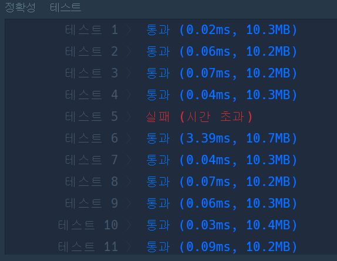
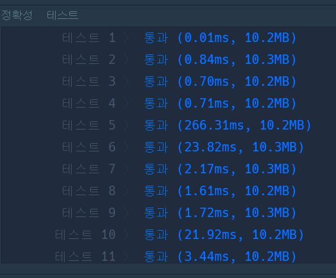
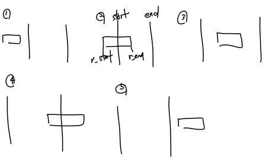

# 프로그래머스 사이트 문제 풀이

## 완주하지 못한 선수

<details>
<summary>풀이</summary>

- participant를 key로 해당 이름을 가지는 사람의 수를 value로 지정했다. 그리하여 completion에서 한명씩 이름을 보아서 dictionary에서 차감한 뒤 나중에 dictionary에 value를 1을 가진 사람이 있으면 그 사람은 혼자 완주하지 못한 사람으로 생각하고 출력하였다.

</details>

<details>
<summary>코드</summary>

```python
def solution(participant, completion):
    answer = ''
    dic = {}
    for p in participant:
        try:
            dic[p] += 1
        except:
            dic[p] = dic.get(p, 1)

    for element in completion:
        dic[element]-=1

    for key, value in dic.items():
        if value == 1:
            answer = key
    return answer
```

</details>

---

## 전화번호 목록

<details>
<summary>풀이</summary>

  - 접두어를 찾으면 그 즉시 종료를 하고 answer에 False를 넣어야한다. 그러므로 주어진 phone_book 리스트를 길이 순으로 정렬을 한 후, 앞에서부터 그 뒤에 있는 모든 문자열의 앞부분만을 비교하여 만약 찾을경우 answer False를 넣고 종료한다.
  - 만약 종료를 하지않고 계속 실행할 경우 효율성 탈락

</details>


<details>
<summary>코드</summary>

```python
def solution(phone_book):
    answer = True
    phone_book.sort(key=len)
    length = len(phone_book)
    #print(phone_book[0]==phone_book[2][0:3])
    for i in range(length):
        #phone_book[i]
        l = len(phone_book[i])
        for j in range(i+1,length):
            if phone_book[i] == phone_book[j][0:l]:
                answer = False
                return answer
    return answer
```

</details>

---

## 징검다리 건너기

<details>
<summary>링크</summary>

-  https://programmers.co.kr/learn/courses/30/lessons/64062
</details>

<details>
<summary>풀이 방법</summary>

  - 처음 푼 방법
    - k만큼의 window를 설정한 뒤, stones를 window만큼 보면서 window안 가장 큰 값을 기억한다. 이런식으로 stones를 전부 보면 기억한 값 중 가장 작은 값이 정답이다.
    - 하지만 이는, 정확성에서는 다맞아도, 효율적이지 못하다(O(N^2))이기때문.
  - 두번째로 푼 방법
    - O(N^2)보다 더 좋게 풀어야한다. 그래서 O(NlogN)으로 풀기위해 이진탐색을 생각했다.
    - 이진탐색 대상은 몇명이 건널 수 있냐로 설정했고 min=1,max=200,000,000으로 한 뒤, stones를 처음부터 끝까지 보는 와중 min~max 사이의 수가 3번 이상 나오면 max 값을 줄여주고(max = mid), 만약 전부다 통과할 경우 min값을 늘려준다(min = mid).
    - 이러한 과정을 통해서, 결국 마지막에는 max = mid 후 break문에 들어가서 while의 조건인 min < max -1을 벗어나 탈출하며 return max를하면 정답이 나온다.

</details>
---

## 불량 사용자

<details>
<summary>링크</summary> 

- https://programmers.co.kr/learn/courses/30/lessons/64064?language=python3

</details>

<details>

<summary>풀이 방법</summary>

- 처음 푼 방법
  - user_id를 글자수에 따라 digit 리스트에 넣어준다.
  - 그 후, banned_id의 원소들을 처음부터 하나씩 비교하면서, 해당 banned_id와 조건이 부합한 user_id를 rem에 넣어준다.
  - 그 다음, rem에서 리스트간의 product를 하고, 원소들을 정렬시킨 뒤 넣어준다.
  - 그 후 rem을 하나씩 보면서 똑같은 id가 있으면 이를 결과에서 제거한다.
  - 그러면 제거가 끝나고 남은 answer가 정답이다.
  - 하지만, test case5에서 시간초과 발생.(근데 또 이상한게 다른 case들에서의 시간은 엄청 빠르게 동작)
  

  <details>
  <summary>코드</summary>

  ```python
  from itertools import product

  def solution(user_id, banned_id):
      digit = [[] for _ in range(9)]
      rem = []
      for u in user_id:
          digit[len(u)].append(u)
      for i in range(len(banned_id)):
          rem.append([])
          b_len = len(banned_id[i])
          for d in digit[b_len]:
              cnt = 0
              for j in range(b_len):
                  if banned_id[i][j] != '*' and banned_id[i][j] != d[j]:
                      break
                  cnt+=1
              if cnt == b_len:
                  rem[i].append(d)

      temp = []
      for i in list(product(*rem)):
          temp.append(tuple(sorted(i)))

      temp = list(set(temp))
      answer = len(temp)
      for x in temp:
          for j in range(len(i)-1):
              if x[j] == x[j+1]:
                  answer-=1
                  break
      return answer
  ```
  </details>
- 두번째로 푼 방법
  - 처음 user_id로부터 가능한 순열들을 구한다.
  - 그 후, 각 문자들이 banned_id와 조건이 부합한지 검사를 하며 부합할 경우 해당 candidate_users를 set으로 묶은 후 해당 set이 rem 리스트 안에 없을 경우 rem안에 넣어준다.
  - 모든 순열들을 검사한 뒤, rem의 길이를 반환하면 정답이다.
  - 이거는 방법1)보다는 대체적으로 느리지만, 테스트 5는 통과하는 모습이다.
  - 
  
  <details>

  <summary>코드</summary>

  ```python
  from itertools import permutations

  def solution(user_id, banned_id):
      rem = []
      for candidate_users in permutations(user_id, len(banned_id)):
          #print(candidate_users)
          check = True
          for i in range(len(banned_id)):
              c_len = len(candidate_users[i])
              b_len = len(banned_id[i])
              if c_len != b_len:
                  check = False
                  break
              for j in range(b_len):
                  if banned_id[i][j] == '*' or banned_id[i][j] == candidate_users[i][j]:
                      continue
                  else:
                      check = False
                      break
          if check == False:
              continue
          candidate_users = set(candidate_users)
          if candidate_users not in rem:
              rem.append(candidate_users)

      return len(rem)
  ```

  </details> 

</details>

---

## 호텔 방 배정

<details>
<summary>링크</summary>

- https://programmers.co.kr/learn/courses/30/lessons/64063

</details>


<details>
<summary>풀이 방법</summary>

- 문제를 보자마자 union-find를 써야하겠다는 느낌이왔다.
- 하지만, 처음 시도때는 마음대로 풀리지가 않아서 일단 정확도라도 맞추자는 식으로 navie하게 반복문을 통해 0이 나오지 않을때까지 검사해서 넣어주는 식으로 하였다.
```python
# naive(정확도o, 효율성x)
def solution(k, room_number):
    answer = []
    data = [0 for i in range(k+1)]

    for r in room_number:
        if data[r] == 0:
            data[r] = r
            answer.append(r)
        else:
            rem = r
            while True:
                rem += 1
                if data[rem] == 0:
                    data[rem] = rem
                    answer.append(rem)
                    break
```

- 그 후, 인터넷을 찾아본 결과, 딕셔너리를 활용해서 할 경우 매우 간편하다는 사실을 알고 응용해보았다.
- 그리고, 재귀를 이용하여 문제를 풀때에는 재귀의 횟수 제한을 꼭 풀어주자
- parent는 해당 방은 이미 예약이 되어 있어 다음 방 번호를 가리키고 있다. 그리하여 find_parent(parent,parent[x])를 할 경우, 재귀적으로 빈 방으로 안내해준다.
```python
import sys
sys.setrecursionlimit(10**8)

def find_parent(parent,x):
    if x not in parent:
        parent[x] = x+1
        return x
    parent[x] = find_parent(parent,parent[x])
    return parent[x]

def solution(k, room_number):
    answer = []
    parent = {}

    for r in room_number:
        answer.append(find_parent(parent,r))
    return answer
```

</details>

---

## 네트워크

<details>
<summary>풀이 방법</summary>

전형적인 BFS/DFS 문제이다.

노드가 n개 만큼있으니 n개의 노드를 검사하면서 visited가 False인 node를 검사할때 answer+=1해주며, 그 순간 bfs 혹은 dfs를 통해 방문한 노드를 체크해준다. 그러면 같은 네트워크가 형성된다.

</details>

---

## 섬 연결하기

<details>
<summary>풀이 방법</summary>

처음에는 보자마자 크루스칼 알고리즘을 떠올렸다. 그리고 정답을 맞췄다.

그리고 다른 사람들의 코드를 보니 우선순위 큐를 이용해서 푼 사람들의 코드가 있다는 사실을 알았고, 이를 이용해서 풀면 다른 그리디 문제들도 쉽게 풀 수 있을거 같다는 생각이 들었다.

</details>

<details>
<summary>코드(우선순위 큐)</summary>

```python
import heapq

def find_parent(parent,x):
    if parent[x] != x:
        parent[x] = find_parent(parent,parent[x])
    return parent[x]

def union_parent(parent,a,b):
    a = find_parent(parent,a)
    b = find_parent(parent,b)

    if a < b:
        parent[b] = a
    else:
        parent[a] = b

def solution(n, costs):
    answer = 0
    pq = []
    graph = [[] for _ in range(n)]
    parent = [i for i in range(n)]

    for a,b,c in costs:
        graph[a].append([b,c])
        graph[b].append([a,c])
        heapq.heappush(pq,[c,a,b])

    edges_cnt = 0
    while edges_cnt != n-1:
        c,a,b = heapq.heappop(pq)

        a = find_parent(parent,a)
        b = find_parent(parent,b)

        if a != b:
            union_parent(parent,a,b)
            answer += c
            edges_cnt+=1

    return answer
```

</details>

<details>
<summary>코드(크루스칼)</summary>

```python
def find_parent(parent,x):
    if parent[x] != x:
        parent[x] = find_parent(parent,parent[x])
    return parent[x]

def union_parent(parent,a,b):
    a = find_parent(parent,a)
    b = find_parent(parent,b)

    if a < b:
        parent[b] = a
    else:
        parent[a] = b

def solution(n, costs):
    answer = 0
    graph = [[] for _ in range(n)]
    parent = [i for i in range(n)]
    costs.sort(key = lambda x:x[2])

    for a,b,c in costs:
        graph[a].append([b,c])
        graph[b].append([a,c])

    edges_cnt = 0
    for a,b,c in costs:
        if edges_cnt == n-1:
            break
        a = find_parent(parent,a)
        b = find_parent(parent,b)

        if a != b:
            union_parent(parent,a,b)
            answer += c
            edges_cnt += 1

    return answer
```

</details>

---

## 입국심사

<details>
<summary>풀이 방법</summary>

처음에는 입력의 숫자를 보고 이분탐색으로 해결해야한다는 느낌이 들었지만 도저히 방법이 떠오르지 않았다. 그래서 일단 naive하게 풀었지만 역시나 테스트케이스 절반만 정답을 맞추고 나머지는 시간초과가 떴다. 고민을 해봤지만 풀지 못해서, 인터넷의 다른 사람의 풀이방법대로 문제를 풀었다.
>참고 : https://kdgt-programmer.tistory.com/60

이분탐색의 대상은 **답이 될 수 있는 검색시간**이다. 그러므로, 범위를 1 ~ (답이 될 수 있는 검색시간의 최대 범위)이다. 여기서 답이 될 수 있는 검색시간의 최대값은 n*min(times)이다.

그 후, 이분 탐색을 수행하면서 각 심사대가 mid 시간에 수용할 수 있는 사람 수를 계산한다. 

이 사람들의 수가 n보다 크거나 같을 경우 mid의 값을 줄여야 하므로 right = mid -1을 해주고, 이때의 mid값을 answer에 저장해준다. 

이 사람들의 수가 n보다 작을 경우 mid의 값을 늘려야 하므로 left = mid + 1을 해준다.

그러면, 자연스럽게 해당 값을 찾을 수 있다.

</details>

<details>
<summary>코드</summary>

```python
def solution(n, times):
    answer = 0
    left = 1
    right = min(times) * n

    while left <= right:
        mid = (left+right)//2
        temp = n

        for t in times:
            temp -= mid//t
            if temp <= 0:
                right = mid - 1
                answer = mid
                break

        if temp >0:
            left = mid + 1

    return answer
```

<details>
<summary>느낀점</summary>

이분탐색의 문제를 많이 풀어봐야겠다.

이분탐색에서 가장 중요하다고 생각하는 부분은 **이분 탐색의 대상**을 정해야한다는 점이다.

이러한 이분 탐색 대상을 정하는 방법에 능통해져야겠다.

이분탐색의 대상이 될 수 있는 점은 입력의 N의 값을 이분탐색의 대상으로 하거나, 혹은 **답이 될 수 있는 값**을 찾는 것도 가능하다는 것을 알았다.

</details>

</details>

---

## 징검다리

<details>
<summary>링크</summary>
https://programmers.co.kr/learn/courses/30/lessons/43236

</details>

<details>
<summary>풀이 방법</summary>

1 <= distance <= 1,000,000,000을 보고 이분탐색의 느낌이 강했다. 그래서 입국심사 문제를 떠올리면서 이분탐색의 대상을 정하기로 했다.

이분탐색의 대상은 정답의 범위를 대상으로 삼았다. 즉, 바위를 n개 제거한 뒤 각 지점 사이의 거리의 최솟값을 뜻한다.

이분탐색을 진행하면서 오름차순으로 rocks에 저장된 바위들을 순서대로 살펴본다. 

mid 값을 기준으로 저장된 prev에서 검사하는 rock의 거리를 비교한다.
    - mid > rock - prev
      - 이 뜻은 바위를 제거해야 각 바위의 최소값이 mid보다 커진다. 그러므로, 해당바위를 제거한다는 의미로 remove_cnt를 +1 해준다.
    - mid <= rock - prev
      - 이 뜻은 바위를 제거하면 안된다는 의미로 prev를 해당 바위로 설정하여 이 바위부터 거리를 잰다는 의미로 나타낸다.

위 로직이 끝난 뒤 
    - remove_cnt가 제거 바위 숫자인 n보다 크다면 mid 값을 줄여야 하므로 right = mid - 1
    - removen_cnt <= n 이면, answer = mid에 저장하고, mid 값을 올려야하므로 left =mid + 1해준다.


</details>

<details>
<summary>코드</summary>

```python
# 징검다리
def solution(distance, rocks, n):
    answer = 0
    left = 0
    right = distance

    rocks.sort()

    while left <= right:
        mid = (left+right)//2
        remove_cnt = 0
        prev = 0

        for rock in rocks:
            if mid > rock - prev:
                remove_cnt += 1
            else:
                prev = rock

        if remove_cnt > n:
            right = mid - 1
        else:
            answer = mid
            left = mid + 1

    return answer

print(solution(25,[2, 14, 11, 21, 17],2))
```

</details>

<details>
<summary>느낀점</summary>

이분 탐색문제는 탐색의 대상을 정하는 것이고 이러한 대상은 주로 `정답의 범위`가 된다는 점을 알았다.

</details>

---

## 디스크 컨트롤러

<details>
<summary>링크</summary>

https://programmers.co.kr/learn/courses/30/lessons/42627

</details>

<details>
<summary>풀이 방법</summary>

주어진 입력을 jobs_pq로 우선순위 큐를 만든다.

now_time을 두어서 jobs_pq를 pop하면서 디스크가 받아진 시간(jobs[i][0])이 now_time에 있다면 우선순위큐(pq)에 넣어준다. 만약, 없을 경우는 break를 하면 된다. 그 후, pq에서 하나를 pop한 뒤 answer += (now_time-job[0]) 를 하면 된다.

이때, 하나 조심해야할 점은 아래와 같이 입력이 들어올 수도 있다.
> print(solution([[0, 3], [4, 9], [5, 6]]))

이럴 경우, [0,3]을 처리 후, now_time이 3이되는데 이 안에 드는 경우가 없으므로 jobs_pq의 첫번째 job을 가져온 뒤 해당 시작 시간을 now_time을 만들어주고 다시 jobs_pq에 push 해주어야한다.

</details>

<details>
<summary>느낀점</summary>

이 문제는 그리디라고 생각하고 있는데 그리디같은경우는 우선순위 큐를 이용하여 문제를 풀 경우 접근을 잘 할 수 있을 것 같다.

근데 코드가 좀 더럽다. 다른 사람들이 푼 코드를 보고 개선을 해야할 거 같다.

</details>

---

## 추석 트래픽

<details>
<summary>링크</summary>

https://programmers.co.kr/learn/courses/30/lessons/17676

</details>

<details>
<summary>풀이 방법</summary>

이 문제의 경우 주어진 input을 내가 다루기 쉽도록 변경을 해줘야한다.

예를들면 아래와 같이 입력이 들어왔다고 생각해보자.
```
[
"2016-09-15 01:00:04.001 2.0s",
"2016-09-15 01:00:07.000 2s"
]
```

그러면 "2016-09-15 01:00:04.001 2.0s" 에서 년도-월-일을 나타내는 `2016-09-15` 없애버리고, `01:00:04.001`이 시각을 second로 바꿔 표현한다. 그러면 01*3600 + 00*60 + 04.001 = 3604.001이 된다. 이 시각은 끝나는 시각(end_time)이 되고, 시작한 시각(start)도 따로 구하였다. 시작한 시각은 strat_time = round(end_time - float(c[:-1]) + 0.001,3) 으로 구했으며, end_time에서 걸리 시간을 빼고 그 후 0.001초를 더해줘야된다.(0~0.999초가 1초동안 진행한 시간이기 때문에)

이렇게 입력값들을 전처리 후, 다음에는 1초내 처리량의 max 값을 구해야하는데, 1ms씩 나눠서 검사하기에는 양이 너무 많다. 그러므로, 생각한 방법이 1초내의 처리량이 변경이 될려면 어떤 부분의 시작점이나 끝점에서 변경이 일어나므로 이러한 부분들만 검사하면된다고 생각했다. 그럴경우 아래의 5가지 경우들이 있다는 사실을 알 수 있다.



이 중 1번과 5번 case를 제외한 경우 전부 해당 시간안에 들어가므로 result+=1을 해주면 된다.

```python
for r in rem:
    r_start, r_end = r
    if r_end < start or r_start > end:
        continue
    result+=1
```

</details>

---

## 합승 택시 요금

<details>
<summary>링크</summary>

https://programmers.co.kr/learn/courses/30/lessons/72413

</details>

<details>
<summary>풀이방법(다익스트라)</summary>

이 문제는 크게 보면, 
```
S -> (합승 하차) -> A 
                ->  B
```
이러한 경로의 총 합의 최소값을 구하는 문제이다.

그러므로, for문을 통해 모든 노드를 검사하면서 s->i,i->a,i->b로 가는 경로의 합이 최소가 되는 경로를 구하면된다.

오랜만에 다익스트라를 사용하니까 기억이 잘안나 당황했다. 가끔씩은 감을 까먹지않게 연습해둬야겠다.

</details>

<details>
<summary>풀이방법(플로이드-워셜)</summary>

처음에는 플로이드-워셜 알고리즘으로 풀이를 했으나 테스트케이스 26에서 시간초과를 받아버렸다. 그래서 다익스트라로 수행함. 자세한 로직은 다익스트라 풀이과정에서 설명하겠다.

</details>

---

## 풍선 터트리기

<details>
<summary>링크</summary>

https://programmers.co.kr/learn/courses/30/lessons/68646

</details>

<details>
<summary>풀이 방법</summary>

주어진 a 리스트의 최대 길이가 1,000,000이다. 그러므로, O(N^2)으로 풀 경우 시간초과가 발생할거 같은 느낌이어서 O(NlogN)의 방법을 고민했다.

처음에는 이분탐색을 사용해보자 생각했지만, 풍선을 터트리기 위해서는 정렬을 하면 안될거 같아서 다음 떠올린 것이 LIS 알고리즘을 이분탐색으로 할 경우를 떠올렸다.

그래서 LIS를 이용해서 이리저리 고민하다가 하나의 방법을 찾아냈다.

이분탐색으로 LIS를 할 경우 해당 숫자가 LIS 배열 내에서의 index를 알 수 있다. 그러한 index를 rem이라는 리스트에 저장한다.

예를들면 아래와 같이 입력이 들어와있다고 가정해보자.
```
[-16,27,65,-2,58,-92,-71,-68,-61,-33]
```

그러면 rem 리스트에는 아래와 같이 저장된다.
```
[1,2,3,2,3,1,2,3,4,5]
```

그 후, min = int(1e9)를 두고 이러한 rem리스트를 오른쪽에서 부터 검사하여 min > rem[?] 일 경우, answer+=1을 해주고 min 값을 rem[?]로 바꿔준다. 이때, rem[?]가 1일 경우는 무조건 성공하는 경우이므로 그냥 answer+=1을 해주면 정답이 된다.

</details>

---

## [카카오 인턴]키패드 누르기

<details>
<summary>링크</summary>

https://programmers.co.kr/learn/courses/30/lessons/67256

</details>

<details>
<summary>풀이 방법</summary>

이 문제에서 핵심은 2,5,8,0이라는 숫자가 나왔을때 왼손과 오른손 중 무슨 손가락으로 눌러야하는지에 대한 처리가 중요하다고 생각했다.

주어진 키패드에서 내가 처리하기 편하게 `*`은 `10`으로 `0`은 `11`로 `#`은 `12`로 바꿔서 처리하였다.

주어진 입력을 앞에서부터 읽으면서(now), now%3==0이면 오른손, now%3==1이면 왼손을 눌러야하면 누를때마다 각각의 위치에 해당하는 번호를 저장하였다.

그리고 now%3==2이면, 이는 가운데를 눌렀기때문에 왼손과 오른손의 현 위치중에서 가까운 손가락이 눌러야하며 같은 거리일 경우에는 hand에 따라 값이 달라진다.

각각의 손가락이 now의 위치와의 거리를 구하는 방법은 아래와 같다.
```python
left_dist = (int((abs(now-left_location)/3))) + abs(now-left_location)%3
right_dist = (int((abs(now - right_location) / 3))) + abs(now-right_location)%3
```
이때 `(int((abs(now-location)/3)))`은 해당 손가락이 now와 세로로 몇칸 차이나는지 나타내고, `abs(now-location)%3`은 해당 손가락이 now와 가로로 몇칸 차이나는지를 나타낸다.

해당 dist를 구하고 같다면 hand에 따라 각각의 처리를 다르게 하면된다.

풀다가보니까, dist구하는 것을 함수화하면 더 간결해질거같다는것을 깨달았다.

</details>

---

## [카카오 인턴] 수식 최대화

<details>
<summary>링크</summary>

https://programmers.co.kr/learn/courses/30/lessons/67257

</details>

<details>
<summary>풀이방법</summary>

eval()을 이용하여 문제를 해결했다.

예를들어, "100-200*300-500+20" 이라는 input이 들어오면 아래와 같이 리스트화 시켜준다.(end는 끝을 의미)

```python
['100', '-', '200', '*', '300', '-', '500', '+', '20', 'end']
```

그 후, 연산자는 +,-,* 3개이므로 이들의 순열을 구해서 완전탐색하면 된다.
```python
prior = permutations(['+','-','*'],3)
```

그 다음, 연산자 우선순위에 맞게 ex_list를 처음부터 검사하면서 만약 같다면 해당 연산자 앞 뒤로 문자로 만들어서 eval()한 뒤 리스트로 만들어서 다시 만들어주면 된다.
```python
ex_list = ex_list[:idx-1]+[str(eval(''.join((ex_list[idx-1:idx+2]))))]+ex_list[idx+2:]
```

완전 탐색하면서 answer의 max값을 구하면 된다.
```python
answer = max(answer,abs(int(ex_list[0])))
```

</details>

---

## 순위 검색

<details>
<summary>링크</summary>

https://programmers.co.kr/learn/courses/30/lessons/72412

</details>

<details>
<summary>풀이 방법</summary>

문제에 정확성을 요구하는 점에서 일단 이진탐색과 dictionary를 떠올렸다.

그리고 언어,직군,경력,소울푸드의 경우의 수가 별로 없어서 이에 대한 모든 경우의 수를 dictionary의 key로 넣어주었다.
```python
dict_keys(['jbjp', 'jbjc', 'jbj-', 'jbsp', 'jbsc', 'jbs-', 'jb-p', 'jb-c', 'jb--', 'jfjp', 'jfjc', 'jfj-', 'jfsp', 'jfsc', 'jfs-', 'jf-p', 'jf-c', 'jf--', 'j-jp', 'j-jc', 'j-j-', 'j-sp', 'j-sc', 'j-s-', 'j--p', 'j--c', 'j---', 'pbjp', 'pbjc', 'pbj-', 'pbsp', 'pbsc', 'pbs-', 'pb-p', 'pb-c', 'pb--', 'pfjp', 'pfjc', 'pfj-', 'pfsp', 'pfsc', 'pfs-', 'pf-p', 'pf-c', 'pf--', 'p-jp', 'p-jc', 'p-j-', 'p-sp', 'p-sc', 'p-s-', 'p--p', 'p--c', 'p---', 'cbjp', 'cbjc', 'cbj-', 'cbsp', 'cbsc', 'cbs-', 'cb-p', 'cb-c', 'cb--', 'cfjp', 'cfjc', 'cfj-', 'cfsp', 'cfsc', 'cfs-', 'cf-p', 'cf-c', 'cf--', 'c-jp', 'c-jc', 'c-j-', 'c-sp', 'c-sc', 'c-s-', 'c--p', 'c--c', 'c---', '-bjp', '-bjc', '-bj-', '-bsp', '-bsc', '-bs-', '-b-p', '-b-c', '-b--', '-fjp', '-fjc', '-fj-', '-fsp', '-fsc', '-fs-', '-f-p', '-f-c', '-f--', '--jp', '--jc', '--j-', '--sp', '--sc', '--s-', '---p', '---c', '----'])
```
- 이때

```python
rem = [['j','p','c','-'],['b','f','-'],['j','s','-'],['p','c','-']]
for x in list(product(*rem)):
    info_dict[''.join(x)] = []
```

이런식으로 코드를 구현했으며, 오랜만에 product를 사용해서 정리노트를 보고 사용하는걸 참고했다.

그 후, 입력으로 주어진 infos를 위와 같은 형태로 바꾸고 총 16가지 경우로 '-'를 대치한 문자를 key로 넣어주고 점수를 value로 넣어주었다.

```python
for info in infos:
    rem = info.split()
    string = ''
    for i in range(5):
        if i == 4:
            for k in range(5):
                for j in combinations(range(1,5),k):
                    temp = list(string)
                    for x in j:
                        temp[x-1] = '-'
                    info_dict[''.join(temp)].append(int(rem[i]))
        string+=rem[i][0]
```

그러면 key에 해당하는 점수들이 나열되어있는데 이를 이진탐색으로 개수를 파악하기 위해서 오름차순으로 sorting해주었다.

```python
for key in info_dict.keys():
    info_dict[key].sort()
```
마지막으로, 입력으로 주어진 query로 위와 같이 전처리 후, 해당 key에 해당하는 (value 리스트 길이 - query에서 주어진 점수)를 answer에 추가해주면 된다.

```python
for qry in query:
    temp = qry.split(' and ')
    temp = temp[:3] + temp[3].split()
    score = temp[4]
    string = ''
    for i in range(4):
        string+=temp[i][0]
    answer.append(len(info_dict[string])-bisect_left(info_dict[string],int(score)))
```

</details>

<details>
<summary>느낀점</summary>

1. dictionary를 활용하는 법에 익숙해지자.
2. combination, products 사용법에 익숙해지자.

</details>

---

## [2021 카카오]식뉴 아이디 추천

<details>
<summary>링크</summary>

https://programmers.co.kr/learn/courses/30/lessons/72410

</details>

<details>
<summary>풀이 방법</summary>

그냥 로직에 맞게 순서대로 구현했다.

근데 만약에 문자열 처리중 빈문자가 되어버리면 index 처리가 까다로울수 있어서 check하는것을 추가해서 검사함.

</details>

<details>
<summary>느낀점</summary>

그냥 로직에 맞게 순서대로 구현했다.

근데 나중에 찾아보니까 `정규식`이라는것이 있다는것을 알았다.

공부하면 편할듯...?

</details>