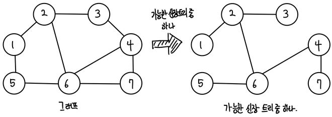
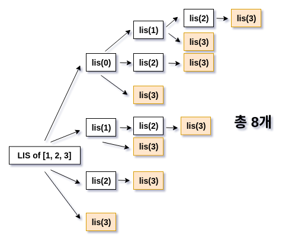
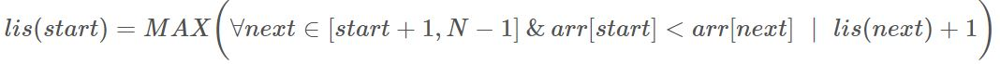

# 파이썬 알고리즘 정리 노트

## 경우의 수

<details>
<summary>순열(Permutations)</summary>

- 순열 : 순서가 상관있는 경우의 수
  
- 2개 순열

    ```python
    from itertools import permutations
    item = ['1','2',1,3,['a','b']]
    print(list(permutations(item,2)))
    ```
    <details>
    <summary>출력</summary>
        [('1', '2'), ('1', 1), ('1', 3), ('1', ['a', 'b']), ('2', '1'), ('2', 1), ('2', 3), ('2', ['a', 'b']), (1, '1'), (1, '2'), (1, 3), (1, ['a', 'b']), (3, '1'), (3, '2'), (3, 1), (3, ['a', 'b']), (['a', 'b'], '1'), (['a', 'b'], '2'), (['a', 'b'], 1), (['a', 'b'], 3)]
    </details>
    <br /><br />

- 3개 순열

    ```python
    from itertools import permutations
    item = ['1','2',1,3,['a','b']]
    print(list(permutations(item,3)))
    ```
    <details>
    <summary>중복된 출력</summary>
        [('1', '2', 1), ('1', '2', 3), ('1', '2', ['a', 'b']), ('1', 1, '2'), ('1', 1, 3), ('1', 1, ['a', 'b']), ('1', 3, '2'), ('1', 3, 1), ('1', 3, ['a', 'b']), ('1', ['a', 'b'], '2'), ('1', ['a', 'b'], 1), ('1', ['a', 'b'], 3), ('2', '1', 1), ('2', '1', 3), ('2', '1', ['a', 'b']), ('2', 1, '1'), ('2', 1, 3), ('2', 1, ['a', 'b']), ('2', 3, '1'), ('2', 3, 1), ('2', 3, ['a', 'b']), ('2', ['a', 'b'], '1'), ('2', ['a', 'b'], 1), ('2', ['a', 'b'], 3), (1, '1', '2'), (1, '1', 3), (1, '1', ['a', 'b']), (1, '2', '1'), (1, '2', 3), (1, '2', ['a', 'b']), (1, 3, '1'), (1, 3, '2'), (1, 3, ['a', 'b']), (1, ['a', 'b'], '1'), (1, ['a', 'b'], '2'), (1, ['a', 'b'], 3), (3, '1', '2'), (3, '1', 1), (3, '1', ['a', 'b']), (3, '2', '1'), (3, '2', 1), (3, '2', ['a', 'b']), (3, 1, '1'), (3, 1, '2'), (3, 1, ['a', 'b']), (3, ['a', 'b'], '1'), (3, ['a', 'b'], '2'), (3, ['a', 'b'], 1), (['a', 'b'], '1', '2'), (['a', 'b'], '1', 1), (['a', 'b'], '1', 3), (['a', 'b'], '2', '1'), (['a', 'b'], '2', 1), (['a', 'b'], '2', 3), (['a', 'b'], 1, '1'), (['a', 'b'], 1, '2'), (['a', 'b'], 1, 3), (['a', 'b'], 3, '1'), (['a', 'b'], 3, '2'), (['a', 'b'], 3, 1)]
    </details>
    <br /><br />

- 순열은 중복이 됨
    ```python
    from itertools import permutations
    op = ['+', '+', '-', '*', '/']
    per = list(permutations(op,len(op)))
    ```
    <details>
    <summary>출력(len=120)</summary>
    [('+', '+', '-', '*', '/'), ('+', '+', '-', '/', '*'), ('+', '+', '*', '-', '/'), ('+', '+', '*', '/', '-'), ('+', '+', '/', '-', '*'), ('+', '+', '/', '*', '-'), ('+', '-', '+', '*', '/'), ('+', '-', '+', '/', '*'), ('+', '-', '*', '+', '/'), ('+', '-', '*', '/', '+'), ('+', '-', '/', '+', '*'), ('+', '-', '/', '*', '+'), ('+', '*', '+', '-', '/'), ('+', '*', '+', '/', '-'), ('+', '*', '-', '+', '/'), ('+', '*', '-', '/', '+'), ('+', '*', '/', '+', '-'), ('+', '*', '/', '-', '+'), ('+', '/', '+', '-', '*'), ('+', '/', '+', '*', '-'), ('+', '/', '-', '+', '*'), ('+', '/', '-', '*', '+'), ('+', '/', '*', '+', '-'), ('+', '/', '*', '-', '+'), ('+', '+', '-', '*', '/'), ('+', '+', '-', '/', '*'), ('+', '+', '*', '-', '/'), ('+', '+', '*', '/', '-'), ('+', '+', '/', '-', '*'), ('+', '+', '/', '*', '-'), ('+', '-', '+', '*', '/'), ('+', '-', '+', '/', '*'), ('+', '-', '*', '+', '/'), ('+', '-', '*', '/', '+'), ('+', '-', '/', '+', '*'), ('+', '-', '/', '*', '+'), ('+', '*', '+', '-', '/'), ('+', '*', '+', '/', '-'), ('+', '*', '-', '+', '/'), ('+', '*', '-', '/', '+'), ('+', '*', '/', '+', '-'), ('+', '*', '/', '-', '+'), ('+', '/', '+', '-', '*'), ('+', '/', '+', '*', '-'), ('+', '/', '-', '+', '*'), ('+', '/', '-', '*', '+'), ('+', '/', '*', '+', '-'), ('+', '/', '*', '-', '+'), ('-', '+', '+', '*', '/'), ('-', '+', '+', '/', '*'), ('-', '+', '*', '+', '/'), ('-', '+', '*', '/', '+'), ('-', '+', '/', '+', '*'), ('-', '+', '/', '*', '+'), ('-', '+', '+', '*', '/'), ('-', '+', '+', '/', '*'), ('-', '+', '*', '+', '/'), ('-', '+', '*', '/', '+'), ('-', '+', '/', '+', '*'), ('-', '+', '/', '*', '+'), ('-', '*', '+', '+', '/'), ('-', '*', '+', '/', '+'), ('-', '*', '+', '+', '/'), ('-', '*', '+', '/', '+'), ('-', '*', '/', '+', '+'), ('-', '*', '/', '+', '+'), ('-', '/', '+', '+', '*'), ('-', '/', '+', '*', '+'), ('-', '/', '+', '+', '*'), ('-', '/', '+', '*', '+'), ('-', '/', '*', '+', '+'), ('-', '/', '*', '+', '+'), ('*', '+', '+', '-', '/'), ('*', '+', '+', '/', '-'), ('*', '+', '-', '+', '/'), ('*', '+', '-', '/', '+'), ('*', '+', '/', '+', '-'), ('*', '+', '/', '-', '+'), ('*', '+', '+', '-', '/'), ('*', '+', '+', '/', '-'), ('*', '+', '-', '+', '/'), ('*', '+', '-', '/', '+'), ('*', '+', '/', '+', '-'), ('*', '+', '/', '-', '+'), ('*', '-', '+', '+', '/'), ('*', '-', '+', '/', '+'), ('*', '-', '+', '+', '/'), ('*', '-', '+', '/', '+'), ('*', '-', '/', '+', '+'), ('*', '-', '/', '+', '+'), ('*', '/', '+', '+', '-'), ('*', '/', '+', '-', '+'), ('*', '/', '+', '+', '-'), ('*', '/', '+', '-', '+'), ('*', '/', '-', '+', '+'), ('*', '/', '-', '+', '+'), ('/', '+', '+', '-', '*'), ('/', '+', '+', '*', '-'), ('/', '+', '-', '+', '*'), ('/', '+', '-', '*', '+'), ('/', '+', '*', '+', '-'), ('/', '+', '*', '-', '+'), ('/', '+', '+', '-', '*'), ('/', '+', '+', '*', '-'), ('/', '+', '-', '+', '*'), ('/', '+', '-', '*', '+'), ('/', '+', '*', '+', '-'), ('/', '+', '*', '-', '+'), ('/', '-', '+', '+', '*'), ('/', '-', '+', '*', '+'), ('/', '-', '+', '+', '*'), ('/', '-', '+', '*', '+'), ('/', '-', '*', '+', '+'), ('/', '-', '*', '+', '+'), ('/', '*', '+', '+', '-'), ('/', '*', '+', '-', '+'), ('/', '*', '+', '+', '-'), ('/', '*', '+', '-', '+'), ('/', '*', '-', '+', '+'), ('/', '*', '-', '+', '+')]    
    </details>

 - 순열의 중복 없애기(set)
    ```python
    from itertools import permutations
    op = ['+', '+', '-', '*', '/']
    per = list(permutations(op,len(op)))
    ```
    <details>
    <summary>출력(len=60)</summary>
    {('*', '+', '+', '-', '/'), ('+', '*', '-', '+', '/'), ('*', '-', '+', '/', '+'), ('+', '/', '+', '-', '*'), ('+', '/', '-', '+', '*'), ('*', '+', '/', '-', '+'), ('-', '*', '/', '+', '+'), ('+', '/', '-', '*', '+'), ('-', '+', '/', '+', '*'), ('-', '+', '/', '*', '+'), ('*', '+', '+', '/', '-'), ('+', '-', '*', '/', '+'), ('-', '/', '+', '*', '+'), ('*', '-', '/', '+', '+'), ('+', '*', '+', '/', '-'), ('/', '-', '*', '+', '+'), ('/', '+', '*', '+', '-'), ('/', '*', '+', '-', '+'), ('+', '+', '*', '/', '-'), ('/', '-', '+', '+', '*'), ('/', '-', '+', '*', '+'), ('+', '-', '+', '/', '*'), ('/', '+', '+', '*', '-'), ('+', '-', '/', '*', '+'), ('*', '/', '-', '+', '+'), ('/', '*', '-', '+', '+'), ('-', '/', '+', '+', '*'), ('+', '+', '/', '*', '-'), ('-', '*', '+', '+', '/'), ('/', '+', '+', '-', '*'), ('-', '+', '+', '*', '/'), ('+', '/', '*', '-', '+'), ('+', '*', '/', '+', '-'), ('-', '+', '*', '+', '/'), ('+', '/', '*', '+', '-'), ('+', '+', '*', '-', '/'), ('+', '+', '-', '*', '/'), ('*', '+', '/', '+', '-'), ('*', '/', '+', '+', '-'), ('/', '*', '+', '+', '-'), ('+', '+', '-', '/', '*'), ('-', '/', '*', '+', '+'), ('+', '-', '/', '+', '*'), ('-', '*', '+', '/', '+'), ('*', '+', '-', '/', '+'), ('/', '+', '-', '+', '*'), ('-', '+', '+', '/', '*'), ('*', '/', '+', '-', '+'), ('+', '*', '-', '/', '+'), ('/', '+', '-', '*', '+'), ('/', '+', '*', '-', '+'), ('+', '/', '+', '*', '-'), ('*', '-', '+', '+', '/'), ('+', '+', '/', '-', '*'), ('+', '-', '*', '+', '/'), ('+', '*', '+', '-', '/'), ('-', '+', '*', '/', '+'), ('*', '+', '-', '+', '/'), ('+', '-', '+', '*', '/'), ('+', '*', '/', '-', '+')}
    </details>

</details>

<details>
<summary>조합(Combinations)</summary>

- 조합 : 순서 상관없는 경우의 수

- 2개 조합

    ```python
    from itertools import combinations
    item = ['1','2',1,3,['a','b']]
    print(list(combinations(item,2)))
    ```
    <details>
    <summary>출력</summary>
    [('1', '2'), ('1', 1), ('1', 3), ('1', ['a', 'b']), ('2', 1), ('2', 3), ('2', ['a', 'b']), (1, 3), (1, ['a', 'b']), (3, ['a', 'b'])]
    </details><br /><br />

- 3개 조합

    ```python
    from itertools import combinations
    item = ['1','2',1,3,['a','b']]
    print(list(combinations(item,3)))
    ```
    <details>
    <summary>출력</summary>
        [('1', '2', 1), ('1', '2', 3), ('1', '2', ['a', 'b']), ('1', 1, 3), ('1', 1, ['a', 'b']), ('1', 3, ['a', 'b']), ('2', 1, 3), ('2', 1, ['a', 'b']), ('2', 3, ['a', 'b']), (1, 3, ['a', 'b'])]
    </details><br /><br />

</details>

<details>
<summary>중복 순열(product)</summary>

- 코드 예시
  - repeat = ? 에서 ?는 몇개 뽑을지에 대한 수
    ```python
    from itertools import product
    n = 4
    print(list(product(['+','-','*','/'],repeat=(n-1))))
    ```
    <details>
    <summary>출력</summary>
        [('+', '+', '+'), ('+', '+', '-'), ('+', '+', '*'), ('+', '+', '/'), ('+', '-', '+'), ('+', '-', '-'), ('+', '-', '*'), ('+', '-', '/'), ('+', '*', '+'), ('+', '*', '-'), ('+', '*', '*'), ('+', '*', '/'), ('+', '/', '+'), ('+', '/', '-'), ('+', '/', '*'), ('+', '/', '/'), ('-', '+', '+'), ('-', '+', '-'), ('-', '+', '*'), ('-', '+', '/'), ('-', '-', '+'), ('-', '-', '-'), ('-', '-', '*'), ('-', '-', '/'), ('-', '*', '+'), ('-', '*', '-'), ('-', '*', '*'), ('-', '*', '/'), ('-', '/', '+'), ('-', '/', '-'), ('-', '/', '*'), ('-', '/', '/'), ('*', '+', '+'), ('*', '+', '-'), ('*', '+', '*'), ('*', '+', '/'), ('*', '-', '+'), ('*', '-', '-'), ('*', '-', '*'), ('*', '-', '/'), ('*', '*', '+'), ('*', '*', '-'), ('*', '*', '*'), ('*', '*', '/'), ('*', '/', '+'), ('*', '/', '-'), ('*', '/', '*'), ('*', '/', '/'), ('/', '+', '+'), ('/', '+', '-'), ('/', '+', '*'), ('/', '+', '/'), ('/', '-', '+'), ('/', '-', '-'), ('/', '-', '*'), ('/', '-', '/'), ('/', '*', '+'), ('/', '*', '-'), ('/', '*', '*'), ('/', '*', '/'), ('/', '/', '+'), ('/', '/', '-'), ('/', '/', '*'), ('/', '/', '/')]
    </details>


</details>

<details>
<summary>두 개 이상의 리스트에서 모든 경우의 수 구하기(product)</summary>

- 제대로 된 쓰임새(*를 붙여야함)

    ```python
    from itertools import product
    items = [['a','b','c'],[1,2,3,4],['!','@']]
    print(list(product(*items)))
    ```
    <details>
    <summary>출력</summary>
    [('a', 1, '!'), ('a', 1, '@'), ('a', 2, '!'), ('a', 2, '@'), ('a', 3, '!'), ('a', 3, '@'), ('a', 4, '!'), ('a', 4, '@'), ('b', 1, '!'), ('b', 1, '@'), ('b', 2, '!'), ('b', 2, '@'), ('b', 3, '!'), ('b', 3, '@'), ('b', 4, '!'), ('b', 4, '@'), ('c', 1, '!'), ('c', 1, '@'), ('c', 2, '!'), ('c', 2, '@'), ('c', 3, '!'), ('c', 3, '@'), ('c', 4, '!'), ('c', 4, '@')]
    </details><br /><br />

- 잘못된 쓰임새

    ```python
    from itertools import product
    items = [['a','b','c'],[1,2,3,4],['!','@']]
    print(list(product(items)))
    ```
    <details>
    <summary>출력</summary>
    [(['a', 'b', 'c'],), ([1, 2, 3, 4],), (['!', '@'],)]
    </details><br /><br />

    </details>

___
<br />

## 우선순위 큐(Priority Queue)

<details>
<summary>정의</summary>

- 우선순위 큐는 데이터를 추가한 순서대로 제거하는 FIFO 특성을 가진 일반적인 큐와는 달리, 데이터 추가는 어떤 순서로해도 상관이 없지만, 제거될 때는 가장 작은 값(우선 순위가 높은) 제거하는 자료구조이다.

</details>

<details>
<summary>파이썬에서의 구현</summary>

- heapq 라이브러리와 PriorityQueue 라이브러리가 있다
  - 하지만 heapq가 더 빠르게 동작한다. (대신, thread-safe 보장 안함)
- 파이썬에서는 Min Heap을 제공하지만, Max Heap은 제공하지 않는다.
  - 따라서 heapq 라이브러리를 이용하여 Max Heap을 구현해야 할 때는 원소에 (-1)를 곱해줌으로서 부호를 반전 시켜서 사용한다.
- O(N), O(NlogN)
- 삽입
  - heapq.heappush()
- 삭제(원소 꺼내기)
  - heapq.heappop()
- 예제> Heap Sort
    ```python
    import heapq

    def heapsort(iterable):
        h = []
        result = []
        # 모든 원소를 차례대로 힙에 삽입
        for value in iterable:
            heapq.heappush(h,value) # min heap
            #heapq.heappush(h,-value)   # max heap
        # 힙에 삽입된 모든 원소를 차례대로 꺼내어 담기
        # min heap
        for i in range(len(h)):
            result.append(heapq.heappop(h))
        # max heap  #[-9,-8,-7,-6,-5,-4,-3,-2,-1,0]
        # for i in range(len(h)):
        #   result.append(-heapq.heappop(h))
        return reseult
    
    result = heapsort([1,3,5,7,9,2,4,6,8,0])
    print(result)
    ```
    - 결과>
      - [0,1,2,3,4,5,6,7,8,9] # min heap
      - [9,8,7,6,5,4,3,2,1,0] # max heap

</details>

___
<br />

## 파이썬 내장 함수
<details>
<summary>수학 수식 계산(eval())</summary>

- eval() : 수학 수식이 문자열 형식으로 들어오면 해당 수식을 계산한 결과 반환.

    ```python
        result = eval("(3+5)*7")
        print(result)
    ```
    <details>
    <summary>출력</summary>

    - 56
  
    </details>

</details>

<details>
<summary>리스트 정렬(sorted())</summary>

- sorted() : iterable 객체가 들어왔을 때, 정렬된 결과 반환/
- key 속성으로 정렬 기준 명시 가능
- reverse = 정렬된 결과 리스트를 뒤집을지 여부 설정

    ```python
        result = sorted([9,1,8,5,4])
        print(result)
        result = sorted([9,1,8,5,4], reverse = True)
        print(result)
    ```
    
    <details>
    <summary>출력</summary>

    - [1, 4, 5, 8, 9]
    - [9, 8, 5, 4, 1]

    </details>

</details>

<details>
<summary>리스트 두번째 key 기준으로 정렬하기(sorted())</summary>

- 리스트의 원소로 리스트나 튜플이 존재할 때, 특정한 기준에 따라서 정렬을 수행할 수 있다.
- 정렬 기준은 key 속성을 이용해 명시 가능.

    ```python
        result = sorted([('홍길동',35),('이순신',75),('아무개',50)], key= lambda x:x[1], reverse=True)
        print(result)
    ```

    <details>
    <summary>출력</summary>

    - [('이순신', 75), ('아무개',50), ('홍길동', 35)]

    </details>

</details>

---
<br />

## bisect(이진 탐색)
<details>
<summary>biset(이진탐색)</summary>

- bisect 라이브러리는 '정렬된 배열'에서 특정한 원소를 찾아야 할 때 매우 효과적.
- bisect_left(a, x)
  - 정렬된 순서를 유지하면서 리스트 a에 데이터 x를 삽입할 가장 왼쪽 인덱스를 찾는 method
- bisect_right(a, x)
  - 정렬된 순서를 유지하도록 리스트 a에 데이터 x를 삽입할 가장 오른쪽 인덱스를 찾는 method
- 위 두 method는 O(logN).
  - 사용 예시
    ```python
    from bisect import bisect_left, bisect_right

    a = [1,2,4,4,8]
    x = 4

    print(bisect_left(a,x))
    print(bisect_right(a,x))
    ```
    <details>
    <summary>출력</summary>
    2<br/>
    4
    </details>

- 위 두 method는 '정렬된 리스트'에서 '값이 특정 범위에 속하는 원소의 개수'를 구하고자 할 때, 효과적으로 사용 가능.
  - 사용 예시
    ```python
    from bisect import bisect_left, bisect_right

    # 값이 [left_value,right_value]인 데이터의 개수를 반환하는 함수
    def count_by_range(a, left_value, right_value):
        right_index = bisect_right(a,right_value)
        left_index = bisect_left(a,left_value)
        return right_index - left_index

    # 리스트 선언
    a = [1,2,3,3,3,3,4,4,8,9]
    # 값이 4인 데이터 개수 출력
    print(count_by_range(a,4,4))
    # 값이 [-1,3] 범위에 있는 데이터 개수 출력
    print(count_by_range(a,-1,3))
    ```
    
    <details>
    <summary>출력</summary>
    2<br/>
    6
    </details>

</details>

<details>
<summary>이진 탐색 직접 구현 함수</summary>

```python
def count_by_value(array,x):
    # 데이터의 개수
    n = len(array)

    # x가 처음 등장한 인덱스 계산
    a = first(array,x,0,n-1)

    # 수열에 x가 존재하지 않는 경우
    if a == None:
        return 0

    # x가 마지막으로 등장한 인덱스 계산
    b = last(array,x,0,n-1)

    # 개수를 반환
    return b - a + 1

# 처음 위치를 찾는 이진 탐색 메서드
def first(array,target,start,end):
    if start > end:
        return None
    mid = (start + end)//2
    # 해당 값을 가지는 원소 중에서 가장 왼쪽에 있는 경우에만 인덱스 반환
    if (mid == 0 or target > array[mid-1]) and array[mid] == target:
        return mid
    # 중간값의 값 보다 찾고자 하는 값이 작거나 같은 경우 왼쪽 화깅ㄴ
    elif array[mid] >= target:
        return first(array,target,start,mid-1)
    # 중간점의 값 보다 찾고자 하는 값이 큰 경우 오른쪽 확인
    else:
        return first(array,target,mid+1,end)

def last(array,target,start,end):
    if start>end:
        return None
    mid = (start + end) // 2
    # 해당 값을 가지는 원소 중에서 가장 오른쪽에 있는 경우에만 인덱스 반환
    if (mid==n-1 or target<array[mid+1]) and array[mid] == target:
        return mid
    # 중간점의 값 보다 찾고자 하는 값이 작은 경우 왼쪽 확인
    elif array[mid] > target:
        return last(array,target,start,mid-1)
    # 중간점의 값 보다 찾고자 하는 값이 크거나 같은 경우 오른쪽 확인
    else:
        return last(array,target,mid+1,end)
```

</details>


<details>
<summary>이진 탐색 & 파라메트릭 서치(Parametric Search)</summary>

- 파라메트릭 서치
  - 최적화 문제(문제의 상황을 만족하는 특정 변수의 최솟값, 최댓값을 구하는 문제)를 결정 문제('예 혹은 '아니오'로 답하는 문제')로 바꾸어 해결하는 기법.
  - '원하는 조건을 만족하는 가장 알맞은 값을 찾는 문제'에 주로 파라메트릭 서치 사용.
  - ex> 범위 내에서 조건을 만족하는 가장 큰 값을 찾으라는 최적화 문제라면 이진 탐색으로 결정 문제를 해결하면서 범위를 좁혀갈 수 있다.
  - https://sarah950716.tistory.com/16 -> 예제

</details>

---
<br />

## 정렬(sort)

<details>
<summary>lambda(key 정렬 정의)</summary>

- ```python
    data.sort(key=lambda x : (-x[1], x[2], -x[3],x[0]))
  ```
  - 이런식으로 정렬 정의 가능
  - -x[1] : 두번째 key를 내림차순으로 정렬.
  - x[2] : 세번째 key를 오름차순으로 정렬.


- 예제
    ```python
    N = int(input())
    data = []
    for i in range(N):
        # 이런식으로 하나하나 받을 수 있음
        name, korean, english, math = input().split()
        data.append([name,int(korean),int(english),int(math)])

    # 의미
    # 1. 국어 점수가 감소하는 순서로
    # 2. 국어 점수가 같으면 영어 점수가 증가하는 순서로
    # 3. 국어 점수와 영어 점수가 같으면 수학 점수가 감소하는 순서로
    # 4. 모든 점수가 같으면 이름이 사전 순으로 증가하는 순서로 (단, 아스키코드에서 대문자는 소문자보다 작으므로 사전 순으로 앞에 옵니다.)
    data.sort(key=lambda x : (-x[1], x[2], -x[3],x[0]))
    for i in range(N):
        print(data[i][0])
    # input
    # 12
    # Junkyu 50 60 100
    # Sangkeun 80 60 50
    # Sunyoung 80 70 100
    # Soong 50 60 90
    # Haebin 50 60 100
    # Kangsoo 60 80 100
    # Donghyuk 80 60 100
    # Sei 70 70 70
    # Wonseob 70 70 90
    # Sanghyun 70 70 80
    # nsj 80 80 80
    # Taewhan 50 60 90
    ```
    
    <details>
    <summary>출력</summary>
    Donghyuk <br />
    Sangkeun <br />
    Sunyoung <br />
    nsj <br />
    Wonseob<br />
    Sanghyun<br />
    Sei<br />
    Kangsoo<br />
    Haebin<br />
    Junkyu<br />
    Soong<br />
    Taewhan<br />
    </details>

</details>

---
<br />

## 리스트 다루기(list)

<details>
<summary>리스트 슬라이싱(리스트 원소 뒤집기 가능)</summary>

- 리스트에서 연속적인 위치를 갖는 원소들을 가져와야 할 때 슬라이싱(Slicing) 사용.
- 대괄호 안에 콜론(:)을 넣어서 시작 인덱스와 (끝 인덱스 -1)을 설정할 수 있다.
- ex>
```python
a = [1,2,3,4,5,6,7,8,9,10]
print(a[3:5])
print(a[:4])
print(a[7:])
```
<details>
<summary>출력</summary>
[4,5]<br />
[1,2,3,4]<br />
[8,9,10]<br />
</details>

- a[:] == a
- a[::2] == step(간격)을 2로 해서 뽑아내기
    ```python
    print(a[::2])
    ```
    <details>
    <summary>출력</summary>
    [1,3,5,7,9]
    </details>
- a[-1::-2] == 마지막 요소부터 시작해서 앞으로 하나 건너 하나씩 요소를 가져오기.
    ```python
    print(a[-1::-2])
    ```
    <details>
    <summary>출력</summary>
    [10,8,6,4,2]
    </details>
- ex2>
    ```python
    print(a[1::])
    print(a[-1::])
    print(a[-1::-1])
    print(a[-1::-2])
    print(a[1::-2])
    ```
    <details>
    <summary>출력</summary>
    [2, 3, 4, 5, 6, 7, 8, 9, 10] <br />
    [10]<br />
    [10, 9, 8, 7, 6, 5, 4, 3, 2, 1]<br />
    [10, 8, 6, 4, 2]<br />
    [2]<br />
    </details>

</details>

<details>
<summary>list.count(x) x 개수 세기</summary>

- list.count(x)를 사용하면 해당 list안에 x가 몇개 있는지 return한다.
- O(N)
```python
    a = ['a','b','c','c','c','d','d']
    b = [1,1,2,2,2,2,3,7,7,8,8,8]
    print(a.count('c'))
    print(b.count('b'))
```
<details>
<summary>출력</summary>
3<br />
3
</details>

- 만약 정렬된 리스트에서 count를 구할때 더 빠르게 구하고 싶다면 bisect를 이용하면 O(logN)으로 구할 수 있다.
```python
from bisect import bisect_left, bisect_right
def count_by_range(a,left_value,right_value):
    right_index = bisect_right(a,right_value)
    left_index = bisect_left(a,left_value)
    return right_index - left_index

a = ['a','b','c','c','c','d','d']
b = [1,1,2,2,2,2,3,7,7,8,8,8]
print(count_by_range(a,'c','c'))
print(count_by_range(b,8,8))
```
<details>
<summary>출력</summary>
3<br />
3
</details>

</details>

---
<br />

## input()관련


<details> 
<summary>여러 값 input()으로 받기</summary>

- 한 line에 서로 다른 형태의 값들을 받기

- 예제
    ```python
    N = int(input())
    data = []
    for i in range(N):
        # 이런식으로 하나하나 받을 수 있음
        name, korean, english, math = input().split()
        data.append([name,int(korean),int(english),int(math)])

    #f = sorted(e, key = lambda x : (x[0], -x[1]))
    data.sort(key=lambda x : (-x[1], x[2], -x[3],x[0]))
    for i in range(N):
        print(data[i][0])
    # input
    # 12
    # Junkyu 50 60 100
    # Sangkeun 80 60 50
    # Sunyoung 80 70 100
    # Soong 50 60 90
    # Haebin 50 60 100
    # Kangsoo 60 80 100
    # Donghyuk 80 60 100
    # Sei 70 70 70
    # Wonseob 70 70 90
    # Sanghyun 70 70 80
    # nsj 80 80 80
    # Taewhan 50 60 90
    ```
  
</details>


<details>
<summary>input() 속도 높이기 sys.stdin.readline</summary>

- 사용 문구

    ```python
    import sys
    input = sys.stdin.readline
    ```

- 사용예시

    ```python
    import sys
    input = sys.stdin.readline

    N,C = map(int,input().split())
    data = []
    for i in range(N):
        data.append(int(input()))
    data.sort()
    ```

</details>

<details>
<summary>한 줄 문자열 -> 2차원 리스트로 input()</summary>

- 예시
```python
for tc in range(int(input())):  # 테스트 케이스 입력 2
    n,m = map(int,input().split())  # 3 4
    array = list(map(int,input().split()))  # 1 3 3 2 2 1 4 1 0 6 4 7

    # 다이나믹 프로그래밍을 위한 2차원 DP 테이블 초기화
    dp = []
    index = 0
    for i in range(n):
        dp.append(array[index:index+m]) # 한 줄 문자열(1차원 리스트) -> 2차원 리스트로 바꾸기
        index += m
```

</details>

---

<br/>

## 최단 경로 알고리즘

<details>
<summary>최단 경로 알고리즘</summary>

- 그래프상에서 가장 짧은 경로를 찾는 알고리즘.
- 겉보기에 최단 경로 문제로 보이지 않더라도, 최소 비용을 구해야 하는 다양한 문제에 최단 경로 알고리즘을 적용할 수 있는 경우가 많다.
- 
    |알고리즘 종류|시간 복잡도|구현 난이도|역할|
    |------|---|---|----|
    |다익스트라|O(*ElogV*)|hard|한 지점에서 다른 모든 지점까지의 최단 경로 계산.|
    |플로이드 워셜|O(*V<sup>3</sup>)*|easy|모든 지점에서 다른 모든 지점까지의 최단 경로 계산.

</details>

<details>
<summary>다익스트라 알고리즘</summary>

- '단계마다 방문하지 않은 노드 중에서 가장 최단 거리가 짧은 노드를 선택'한 뒤, 그 노드를 거쳐 가는 경우를 확인하여 최단 거리 갱신
- 우선순위 큐 사용
- '음의 edge(간선)'이 없을 때 정상적으로 동작
- 알고리즘 원리에 대한 간략한 설명
    1. 출발 노드 설정. 
    2. 최단 거리 테이블 초기화
    3. 방문하지 않은 노드 중에서 최단 거리가 가장 짧은 노드 선택.
    4. 해당 노드를 거쳐 다른 노드로 가는 비용을 계산하여 최단 거리 테이블 갱신
    5. 위 과정에서 3과 4번을 반복.
  - 최단 경로를 구하는 과정에서 '각 노드에 대한 현재까지의 최단 거리' 정보를 항상 1차원 리스트에 저장하며 리스트를 계속 갱신한다는 특징이 있다.(이러한 1차원 리스트를 최단 거리 테이블이라고 한다.)
- 다익스트라 알고리즘 구현 방법 2가지
    1. 구현하기 쉽지만 느리게 동작하는 코드
        - O(*V<sup>2</sup>*) ==> 노드의 개수가 5,000개 이하라면 가능
        - 단계마다 '방문하지 않은 노드 중에서 최단 거리가 가장 짧은 노드를 선택'하기 위해 매 단계마다 1차원 리스트의 모든 원소를 확인(순차 탐색)
        - 
        ```python
        import sys
        input = sys.stdin.readline
        INF = int(1e9)  # 10억

        n,m = map(int,input().split())  # 노드의 개수, 간선의 개수
        start = int(input())    # 시작 노드 번호 입력받기
        graph = [[] for i in range(n+1)]    # 각 노드에 연결되어 있는 노드에 대한 정보를 담는 리스트 만들기
        visited = [False] * (n+1)   # 방문한 적이 있는지 체크하는 목적의 리스트를 만들기
        distance = [INF] * (n+1)    # 최단 거리 테이블을 모두 무한으로 초기화

        # 모든 간선 정보를 입력받기
        for _ in range(m):
        a,b,c = map(int,input().split())
        # a번 노드에서 b번 노드로 가는 비용이 c라는 의미
        graph[a].append((b,c))

        # 방문하지 않은 노드 중에서, 가장 최단 거리가 짧은 노드의 번호를 반환
        def get_smallest_node():
        min_value = INF
        index = 0   # 가장 최단 거리가 짧은 노드(인덱스)
        for i in range(1,n+1):
        if distance[i] < min_value and not visited[i]:
            min_value = distance[i]
            index = i
        return index

        def dijkstra(start):
        # 시작 노드에 대해서 초기화
        distance[start] = 0
        visited[start] = True
        for j in graph[start]:
        distance[j[0]] = j[1]
        # 시작 노드를 제외한 전체 (n-1)개의 노드에 대해 반복
        for i in range(n-1):
        # 현재 최단 거리가 가장 짧은 노드를 꺼내서, 방문 처리
        now = get_smallest_node()
        visited[now] = True
        # 현재 노드와 연결된 다른 노드를 확인
        for j in graph[now]:
            cost = distance[now] + j[1]
            # 현재 노드를 거쳐서 다른 노드로 이동하는 거리가 더 짧은 경우
            if cost < distance[j[0]]:
                distance[j[0]] = cost

        # 다익스트라 알고리즘 수행
        dijkstra(start)

        # 모든 노드로 가기 위한 최단 거리 출력
        for i in range(1,n+1):
        # 도달할 수 없는 경우, 무한이라고 출력
        if distance[i] == INF:
        print("무한")
        # 도달할 수 있는 경우 거리 출력
        else:
        print(distance[i])

        # input
        # 6 11
        # 1
        # 1 2 2
        # 1 3 5
        # 1 4 1
        # 2 3 3
        # 2 4 2
        # 3 2 3
        # 3 6 5
        # 4 3 3
        # 4 5 1
        # 5 3 1
        # 5 6 2    

        ```
        - 출력<br/>
            0<br/>
            2<br/>
            3<br/>
            1<br/>
            2<br/>
            4<br/>
    2. 구현하기에 조금 더 까다롭지만 빠르게 동작하는 코드
        - O(*ElogV*)
        - Heap (우선순위 큐) 사용. (-> 그러므로 선형적 탐색이 아니다 == 시간 복잡도 축소)
          - 다익스트라 최단 경로 알고리즘에서는 비용이 적은 노드를 우선하여 방문하므로 최소 힙 구조를 기반으로 하는 파이썬의 우선순위 큐 라이브러리(heapq)를 그대로 사용하면 적합.
        - 현재 가장 가까운 노드를 저장하기 위한 목적으로만 우선순위 큐를 추가로 이용(즉, 앞서 get_smllest_node()함수는 필요가 없다.)
        - '최단 거리가 가장 짧은 노드'를 선택하는 과정을 다익스트라 최단 경로 함수 안에서 우선순위 큐를 이용하는 방식으로 대체.
        - 기본적으로 있어야하는 자료
        ```python
        import heapq
        n,m = map(int,input().split())
        start = int(input())
        graph = [[] for i in range(n+1)]
        distance = [INF] * (n+1)

        graph[a].append((b,c))  # -> 이렇게가 다익스트라
        #graph[a][b] = c        # -> 이렇게가 플로이드
        
        heapq.heappush(q,(0,start))
        ```

        ```python

        import heapq
        import sys
        input = sys.stdin.readline
        INF = int(1e9)

        n,m = map(int,input().split())  # 노드의 개수, 간선의 개수
        start = int(input())    # 시작 노드 번호 입력받기
        graph = [[] for i in range(n+1)]    # 각 노드에 연결되어 있는 노드에 대한 정보를 담는 리스트 만들기
        distance = [INF] * (n+1)    # 최단 거리 테이블을 모두 무한으로 초기화

        # 모든 간선 정보 입력받기
        for _ in range(m):
            a,b,c = map(int,input().split())
            # a번 노드에서 b번 노드로 가는 비용이 c라는 의미
            graph[a].append((b,c))

        def dijkstra(start):
            q = []
            # 시작 노드로 가기 위한 최단 경로는 0으로 설정하여 ,큐에 삽입
            heapq.heappush(q,(0,start))
            distance[start] = 0
            while q:    # 큐가 비어있지 않다면
                # 가장 최단 거리가 짧은 노드에 대한 정보 꺼내기
                dist,now = heapq.heappop(q)
                # 현재 노드가 이미 처리된 적이 있는 노드라면 무시
                if distance[now] < dist:
                    continue
                # 현재 노드와 연결된 다른 인접한 노드들을 확인
                for i in graph[now]:
                    cost = dist + i[1]
                    # 현재 노드를 거쳐서, 다른 노드로 이동하는 거리가 더 짧은 경우
                    if cost < distance[i[0]]:
                        distance[i[0]] = cost
                        heapq.heappush(q,(cost,i[0]))

        dijkstra(start)

        for i in range(1,n+1):
        if distance[i] == INF:
        print("무한")
        else:
        print(distance[i])

        # 6 11
        # 1
        # 1 2 2
        # 1 3 5
        # 1 4 1
        # 2 3 3
        # 2 4 2
        # 3 2 3
        # 3 6 5
        # 4 3 3
        # 4 5 1
        # 5 3 1
        # 5 6 2

        ```
        - 출력<br/>
            0<br/>
            2<br/>
            3<br/>
            1<br/>
            2<br/>
            4<br/>

</details>

<details>
<summary>플로이드 워셜 알고리즘</summary>

- '모든 지점에서 다른 모든 지점까지의 최단 경로 구해야 하는 경우'
- DP 이용
- '단계마다 거쳐 가는 노드'를 기준으로, 최단 거리 테이블 갱신
- 점화식 : *D*<sub>ab</sub> = *min*(*D*<sub>ab</sub>, *D*<sub>ak</sub>+*D*<sub>kb</sub>)
- 다음과 같이 3중 반복문으로 구현 가능
    ```python
    for k in range(1,n+1):
        for a in range(1,n+1):
            for b in range(1,n+1):
                adj[a][b] = min(adj[a][b], adj[a][k]+adj[k][b])
    ```
- 플로이드 워셜 알고리즘 소스코드
    ```python

    INF = int(1e9)
    import sys
    input = sys.stdin.readline

    # 노드의 개수 및 간선의 개수를 입력받기
    n = int(input())
    m = int(input())
    # 2차원 리스트(그래프 표현)를 만들고, 모든 값을 무한으로 초기화
    graph = [[INF] * (n+1) for _ in range(n+1)]

    # 자기 자신에서 자기 자신으로 가는 비용은 0으로 초기화
    for a in range(1,n+1):
        for b in range(1,n+1):
            if a == b:
                graph[a][b] = 0

    # 각 간선에 대한 정보를 입력받아, 그 값으로 초기화
    for _ in range(m):
        # A에서 B로 가는 비용은 C라고 설정
        a,b,c = map(int,input().split())
        graph[a][b] = c

    # 점화식에 따라 플로이드 워셜 알고리즘을 수행
    for k in range(1,n+1):
        for a in range(1,n+1):
            for b in range(1,n+1):
                graph[a][b] = min(graph[a][b], graph[a][k]+graph[k][b])

    # 수행된 결과를 출력
    for a in range(1,n+1):
        for b in range(1,n+1):
            # 도달할 수 없는 경우, 무한이라고 출력
            if graph[a][b] == INF:
                print("무한", end = ' ')
            # 도달할 수 있는 경우, 거리 출력
            else:
                print(graph[a][b],end = ' ')
        print()

    # 4
    # 7
    # 1 2 4
    # 1 4 6
    # 2 1 3
    # 2 3 7
    # 3 1 5
    # 3 4 4
    # 4 3 2

    ```
    - 출력<br/>
            0 4 8 6 <br/>
            3 0 7 9 <br/>
            5 9 0 4 <br/>
            7 11 2 0 <br/>

</details>

---

<br/>

## 그래프  이론

<details>
<summary>서로소 집합(Disjoint Sets)</summary>

- 서로소 집합 == 공통 원소가 없는 집합
- 서로소 집합 알고리즘
  - union-find(합치기 찾기) 연산으로 구성
    - union : 2개의 원소가 포함된 집합을 하나의 집합으로 합치는 연산.
    - find : 특정한 원소가 속한 집합이 어떤 집합인지 알려주는 연산.
  - 모든 노드는 자신이 속한 집합을 찾을 때 루트 노드를 재귀적으로 찾음.
  - 최소 신장 트리(minimum spanning tree)를 찾는 크루스칼 알고리즘에서 사용
- 서로소 집합 자료구조
  - 서로소 부분 집합들로 나누어진 원소들의 데이터를 처리하기 위한 자료구조
  - 알고리즘
    1. union 연산을 확인하여, 서로 연겨로딘 두 노드 A, B를 확인.
       1. A와 B의 root 노드 A',B'를 각각 찾는다.
       2. A'를 B'의 부모 노드로 설정한다.(B'가 A'를 가리키도록 함) 
    2. 모든 union 연산을 처리할 때까지 1번 반복.
- 개선된 서로소 집합 알고리즘 소스코드
    
    ```python
    # 특정 원소가 속한 집합을 찾기
    def find_parent(parent,x):
        # 루트 노드가 아니라면, 루트 노드를 찾을 때까지 재귀적으로 호출
        if parent[x] != x:
            parent[x] = find_parent(parent,parent[x])
        return parent[x]

    # 두 원소가 속한 집합을 찾기
    def union_parent(parent,a,b):
        a = find_parent(parent,a)
        b = find_parent(parent,b)
        if a<b:
            parent[b] = a
        else:
            parent[a] = b

    # 노드의 개수와 간선(union 연산)의 개수 입력받기
    v, e = map(int,input().split())
    parent = [0] * (v+1)    # 부모 테이블 초기화

    # 부모 테이블상에서, 부모를 자기 자신으로 초기화
    for i in range(1,v+1):
        parent[i] = i

    # union 연산을 각각 수행
    for i in range(e):
        a,b = map(int,input().split())
        union_parent(parent,a,b)

    # 각 원소가 속한 집합 출력
    print('각 원소가 속한 집합: ',end='')
    for i in range(1,v+1):
        print(find_parent(parent,i),end=' ')

    print()

    # 부모 테이블 내용 출력
    print('부모 테이블: ', end='')
    for i in range(1,v+1):
        print(parent[i],end=' ')
        
    # 6 4
    # 1 4
    # 2 3
    # 2 4
    # 5 6
    ```
    - 출력<br/>
        각 원소가 속한 집합: 1 1 1 1 5 5 <br/>
        부모 테이블: 1 1 1 1 5 5 <br/>
- 노드의 개수가 V, 최대 V-1개의 union 연산, M개의 find 연산일때, *O(V+E(1+log<sub>2-M/V</sub>V))*

</details>

<details>
<summary>서로소 집합을 활용한 사이클 판별</summary>

- 무방향 그래프 내에서의 사이클 판별 가능(방향 그래프 적용못함).
  - DFS 이용하여 판별
- 알고리즘
  1. 각 간선을 확인하며 두 노드의 루트 노드를 확인.
     1. 루트 노드가 서로 다르다면 두 노드에 대하여 union 연산 수행.
     2. 루트 노드가 서로 같다면 사이클이 발생한 것. 
  2. 그래프에 포함되어 있는 모든 간선에 대하여 1번 과정을 반복.
- 그래프에 포함되어 있는 간선(edge)의 개수가 E개일 때 모든 간선을 하나씩 확인하며, 매 간선에 대하여 union 및 find 함수를 호출하는 방식으로 동작.

```python
# 노드의 개수와 간선(union 연산)의 개수 입력받기
v,e = map(int,input().split())
parent = [0] * (v+1)

# 부모 테이블상에서, 부모를 자기 자신으로 초기화
for i in range(1,v+1):
    parent[i] = i
cycle = False   # 사이클 발생 여부

for i in range(e):
    a, b = map(int,input().split())
    # 사이클이 발생한 경우 종료
    if find_parent(parent,a) == find_parent(parent,b):
        cycle = True
        break
    # 사이클이 발생하지 않았다면 union 수행
    else:
        union_parent(parent,a,b)

```

</details>

<details>
<summary>신장 트리(spanning tree)</summary>


- 신장 트리
  - 하나의 그래프가 있을 때 모든 노드를 포함하는 부분 그래프를 의미.
  - '모든 섬을 도로를 이용해 연결하는 문제' 등에서 사용될 수 있다.
- 
<<<<<<< HEAD
</details>
=======

</details>

>>>>>>> Today_Solving
<details>
<summary>크루스칼 알고리즘</summary>

- 그리디 알고리즘으로 분류
- 최소한의 비용으로 신장 트리를 찾아야할때 사용
  - ex> N개의 도시가 존재하는 상황에서 두 도시 사이에 도롤르 놓아 전체 도시가 서로 연결될 수 있게 도로를 설치하는 경우 모든 도시를 '연결'할 때, 최소한의 비용으로 연결할려면...?
- 알고리즘
  1. 간선(edge) 데이터를 비용에 따라 오름차순 정렬.
  2. 간선을 하나씩 확인하며 현재의 간선이 사이클을 발생시키는지 확인.
     1. 사이클이 발생하지 않는 경우 최소 신장 트리에 포함.
     2. 사이클이 발생하는 경우 최소 신장 트리에 포함X.
  3. 모든 간선에 대하여 2번의 과정을 반복. 

- 크루스칼 알고리즘 소스코드

    ```python
    v, e = map(int,input().split())
    parent = [0]*(v+1)

    # 모든 간선을 담을 리스트와 최종 비용을 담을 변수
    edges = []
    result = 0

    for i in range(1,v+1):
        parent[i] = i

    for _ in range(e):
        a,b,cost = map(int,input().split())
        # 비용순으로 정렬하기 위해서 튜플의 첫 번째 원소를 비용으로 설정
        edges.append((cost,a,b))

    # 간성을 비용순으로 정렬
    edges.sort()

    # 간선을 하나씩 확인하며
    for edge in edges:
        cost,a,b = edge
        # 사이클이 발생하지 않는 경우에만 집합에 포함
        if find_parent(parent,a) != find_parent(parent,b):
            union_parent(parent,a,b)
            result += cost
    ```
- *O(ElogE)*
  - 왜냐하면, 크루스칼 알고리즘에서 시간이 가장 오래 걸리는 부분이 간선을 정렬하는 작업이기 때문이다.

</details>

<details>
<summary>위상 정렬 알고리즘(topology sort)</summary>

- 큐 혹은 스택 활용해야함.
- 방향 그래프의 모든 노드들을 방향성에 거스르지 않도록 순서대로 나열하는 정렬 기법.
- ex> '선수과목을 고려한 학습 순서 설정 문제'
- *O(V+E)*
- 알고리즘
  1. 진입차수가 0인 노드를 큐에 넣는다.
  2. 큐가 빌 때까지 다음의 과정을 반복.
     1. 큐에서 원소를 꺼내 해당 노드에서 출발하는 간선을 그래프에서 제거한다.
     2. 새롭게 진입차수가 0이 된 노드를 큐에 넣는다.
  3. 만약 모든 원소를 방문하기 전에 큐가 빈다면 사이클이 존재하는 거임. 
- 소스코드
  
    ```python
    from collections import deque

    v,e = map(int,input().split())
    # 모든 노드에 대한 진입차수는 0으로 초기화
    indegree = [0] * (v+1)
    # 각 노드에 연결된 간선 정보를 담기 위한 연결 리스트(그래프) 초기화
    graph = [[] for i in range(v+1)]

    for _ in range(e):
        a,b = map(int,input().split())
        graph[a].append(b)
        # 진입차수 1 증가
        indegree[b] += 1

    # 위상 정렬 함수
    def topology_sort():
        result = [] # 알고리즘 수행 결과를 담을 리스트
        q = deque()

        # 처음 시작할 때는 진입차수가 0인 노드를 큐에 삽입
        for i in range(1,v+1):
            if indegree[i] == 0:
                q.append(i)
        # 큐가 빌 때까지 반복
        while q:
            now = q.popleft()
            result.append(now)
            # 해당 원소와 연결된 노드들의 진입차수에서 1 빼기
            for i in graph[now]:
                indegree[i] -= 1
                # 새롭게 진입차수가 0이 되는 노드를 큐에 삽입
                if indegree[i] == 0:
                    q.append(i)

        # 위상 정렬을 수행한 결과 출력
        for i in result:
            print(i, end=' ')

    topology_sort()

    # 7 8
    # 1 2
    # 1 5
    # 2 3
    # 2 6
    # 3 4
    # 4 7
    # 5 6
    # 6 4
    ```
- *O(V+E)*


</details>

---

<br/>

## LIS 알고리즘(Longest Increasing Subsequence)

- https://shoark7.github.io/programming/algorithm/3-LIS-algorithms

<details>
<summary>개념 설명</summary>

- '최장 증가수열' 또는 '최대 증가 부분수열'로 불린다.
- LIS는 어떤 수열에서 특정 부분을 지워서 만들어낼 수 있는 증가 부분수열(increasing sequence) 중 가장 긴 수열을 말하는데 이때 부분수열의 숫자들은 원 배열에서 위치가 이어져 있지 않아도 된다는 주요한 특징이 있다.
- 순증가(strictly increasing)와 단조증가(monotonically increasing)로 나눌 수 있다.
  - 순증가는 [1,2,3] 처럼 뒤의 숫자가 앞의 숫자보다 무조건 큰 경우를 말한다.
    - LIS는 보통 순증가하는 부분수열을 대상으로 함.
  - 단조증가는 [1,2,2,3] 처럼 뒤의 원소가 앞의 원소 이상인 증가를 말한다.
    - ex> 피보나치 수열

- 예시>[1,4,6,8,3,5,6,7]일 때 [1,6,8],[4,6,8],[1,7]등은 증가 부분수열인데, 이 중 가장 긴 부분열은 [1,3,5,6,7]이 된다. 이때 중간의 4,6,8은 생략한 것을 알 수 있다.

</details>

<details>
<summary>완전탐색(추천X)</summary>

- 명제
  1. 정수 i, j에 대해 i < j이면, S[i] < S[j]다.(0 <= i, j <= |S|)
  2. 정수 i, j에 대해 S[i] < S[j]이면, 원 배열 arr에서의 S[i], S[j] 두 수의 위치 전후관계는 같다.(0 <= i, j <= |S|) 
- 모든 증가 부분수열을 고려한다.
- 원 배열에서 증가 부분수열의 첫 수를 선택하고, 그 다음 수가 될 수 있는, 위의 두 명제처럼 첫 수보다 원 배열에서 뒤에 있고 큰 후보값들의 배열을 추려 재귀해나가면 될 것 같다. 
- 재귀함수가 진행되면서 내 앞의 숫자가 어떤 숫자였는지는 중요하지 않다. 이미 내가 선택되었다는 것은 그 이전의 숫자가 나보다는 작은 숫자라는 것을 말해주고, 또 여기서는 길이만 구하기 때문에 앞선 콜에서 이전값의 길이 1만을 계속 더해나가면 되기 때문이다.

    ```python
    def lis(arr):
        if not arr:
            return 0
        
        ret = 1
        for i in range(len(arr)):
            nxt = []
            for j in range(i+1, len(arr)):
                if arr[i] < arr[j]:
                    nxt.append(arr[j])
            ret = max(ret, 1 + lis(nxt))
        return ret	
    ```
- *O(N<sup>3</sup>)*
- 수형도
  - 
  -  lis(i) 는 i 번째 인덱스의 수부터 원 수열의 끝까지의 lis의 길이를 반환하는데 여기에는 수많은 인덱스의 lis 호출이 쓰였다.
     -  전부 중복 계산 -> 캐싱을 통해 재계산을 없애자(DP)

</details>

<details>
<summary>DP(동적 계획법)</summary>

- 위에서 수형도를 그린 이유는 이 수형도를 통해 동적 계획법의 가능성을 확실히 발견할 수 있기 때문이다.
- 
  - 왼편은 두 조건을 모두 만족하는 next 에 대해서,오른편은 lis(next) + 1 를 실행하고, 그 값들의 최대값이 정답이 된다는 뜻이 된다.
    ```python
    import math


    def lis(arr):
        arr = [-math.inf] + arr
        N = len(arr)
        cache = [-1] * N

        def find(start):
            if cache[start] != -1:
                return cache[start]

            ret = 0
            for nxt in range(start+1, N):
                if arr[start] < arr[nxt]:
                    ret = max(ret, find(nxt) + 1)

            cache[start] = ret
            return ret

        return find(0)

    ``` 

</details>

<details>
<summary>Binary Search(이진 탐색)을 통한 최적화</summary>

- 나중에 다시 공부하기

    ```python
    def lis(arr):
        if not arr:
            return 0

        # C[i] means smallest last number of lis subsequences whose length are i
        INF = float('inf')
        C = [INF] * (len(arr)+1)
        C[0] = -INF
        C[1] = arr[0]
        tmp_longest = 1

        # Find i that matches C[i-1] < n <= C[i]
        def search(lo, hi, n):
            if lo == hi:
                return lo
            elif lo + 1 == hi:
                return lo if C[lo] >= n else hi

            mid = (lo + hi) // 2
            if C[mid] == n:
                return mid
            elif C[mid] < n:
                return search(mid+1, hi, n)
            else:
                return search(lo, mid, n)


        for n in arr:
            if C[tmp_longest] < n:
                tmp_longest += 1
                C[tmp_longest] = n
            else:
                next_loc = search(0, tmp_longest, n)
                C[next_loc] = n

        return tmp_longest
    ``` 

</details>

---

<!--
코드 - 출력  markdown 형식

- 부제목

    ```python
    ```
    <details>
    <summary>출력</summary>
    </details><br /><br />
 -->

