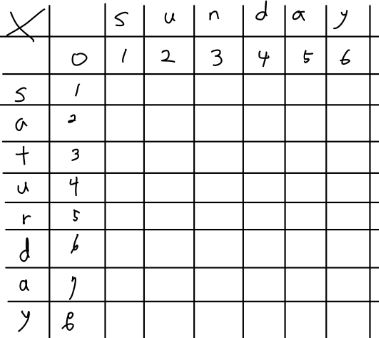
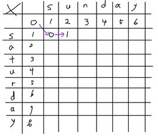
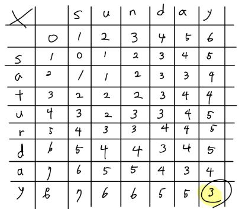

# 파이썬 책 문제에 대한 풀이법

## Q1
<details>
<summary></summary>
</details>

---

## Q17
<details>
<summary>경쟁적 전염</summary>

- 링크 : https://www.acmicpc.net/problem/18405
- 풀이 방법
  - 우선순위 큐(min heap)를 사용하여 (시간,바이러스 번호, x좌표, y좌표)를 원소로 하여 큐에 삽입한다. 
  - 이때, 시간, 바이러스 순으로 우선순위를 가지며 바이러스가 퍼진다.
  - 4방향을 검사하면서 board가 0인 지점의 (시간+1, 바이러스 번호, 좌표1,좌표2)를 우선순위 큐에 넣는다. 
  - 반복하다가 우선순위큐에서 꺼낸 원소의 시간이 S+1이면 그만하고 board[X-1][Y-1] 값을 출력한다.
</details>

---

## Q18
<details>
<summary>괄호 변환</summary>

- 링크 : https://programmers.co.kr/learn/courses/30/lessons/60058
- 풀이 방법(주어진 알고리즘대로 구현함)
  1. 입력이 빈 문자열인 경우, 빈 문자열을 반환합니다. 
  2. 문자열 w를 두 "균형잡힌 괄호 문자열" u, v로 분리합니다. 단, u는 "균형잡힌 괄호 문자열"로 더 이상 분리할 수 없어야 하며, v는 빈 문자열이 될 수 있습니다. 
  3. 문자열 u가 "올바른 괄호 문자열" 이라면 문자열 v에 대해 1단계부터 다시 수행합니다. 
    3-1. 수행한 결과 문자열을 u에 이어 붙인 후 반환합니다. 
  4. 문자열 u가 "올바른 괄호 문자열"이 아니라면 아래 과정을 수행합니다. 
    4-1. 빈 문자열에 첫 번째 문자로 '('를 붙입니다. 
    4-2. 문자열 v에 대해 1단계부터 재귀적으로 수행한 결과 문자열을 이어 붙입니다. 
    4-3. ')'를 다시 붙입니다. 
    4-4. u의 첫 번째와 마지막 문자를 제거하고, 나머지 문자열의 괄호 방향을 뒤집어서 뒤에 붙입니다. 
    4-5. 생성된 문자열을 반환합니다.
- 주의 할 점은 def solution(p)에서 p는 문자열이므로 p의 값으로 줄때 이 값이 리스트인지 생각해봐야한다. 만약 리스트라면 ''.join(p)를 해서 문자열로 변화시킨 후 값을 넘긴다.

</details>

---

## Q19

<details>
<summary>연산자 끼워 넣기</summary>

- 링크 : https://www.acmicpc.net/problem/14888
- 풀이 방법
  - 연산자(+,-,*,/)에 대한 정보를 가지는 op 리스트를 만든다
  - op 리스트에 대한 순열(permutations)을 구한 뒤 중복 값을 막기 위해 set() 처리를 한다.
  - set에 대하여 순서대로 연산한다.

</details>

---

## Q20

<details>
<summary>감시 피하기</summary>

- 링크 : https://www.acmicpc.net/problem/18428
- 풀이 방법
  - 시간 제한이 2초이며, 복도의 크기는 N * N이며, N은 최대 6이다.
  - 따라서, 장애물 3개 설치하는데 모든 경우의 수(조합)는 36C3 = 7140이다.
  - 즉, 완전탐색(DFS,BFS)를 해도 시간초과 걱정이 없다.
  - 벽을 설치할 수 있는 좌표를 가지는 리스트 wall을 만든 후 per = list(permutations(wall,3))를 통해 3개씩 뽑은 후, board에 설치 -> 검사(teacher 위치를 기반으로 검사) -> 벽 지우기를 반복하며, 만약 학생들을 못 발견한다면 YES 출력 후 종료
  - 만약 for 문 밖으로 나올 경우 계속 학생을 발견했다는 말로 NO 출력 후 종료

</details>

---

## Q23

<details>
<summary>국영수</summary>

- 링크 : https://www.acmicpc.net/problem/10825
- 풀이 방법
  - 조건에 맞춰 정렬함.
  - 단, 계수 정렬(radix sort)등과 같은 특별한 상황에서의 정렬 알고리즘이 아닐경우 python에서 제공하는 정렬 라이브러리는 최악의 경우 O(NlogN)을 보장하므로 이를 사용하여 정렬했다.

</details>

---

## Q24

<details>
<summary>안테나</summary>

- 링크 : https://www.acmicpc.net/problem/18310
- 풀이 방법
  - 안테나 설치는 입력 받은 리스트의 가운데 값(Median,중간값)에 설치하면 최소로 할 수 있다.
  - 또한 시간 제한은 1초이며 input은 최대 200,000이므로 N<sup>2</sup>의 경우 40,000,000,000이므로 파이썬의 1초인 20,000,000번을 넘어서 사용하면 안된다.
  - NlogN의 경우 대략 1,000,000이므로 1초내이다.
  - 그리하여 sort()를 사용시 괜찮으며, 그 후 중간 값을 구했다.

</details>

---

## Q25

<details>
<summary>실패율</summary>

- 링크 : https://programmers.co.kr/learn/courses/30/lessons/42889
- 풀이 방법
  - stages의 수만큼 반복하며 각각의 스테이지에 해당하는 stages[] 리스트에서의 개수를 구한다(이때, bisect를 사용해서 구함.)
  - 그리하여 실패율과 해당 stage를 저장하는 rem에 저장하고 분모(denominator)에서 해당 개수를 뺀 후 반복하면서 실패율을 구한다.
  - 그후 실패율, stage 순으로 정렬한 뒤 answer에는 stage만 담아 return한다.

</details>

---

## Q26

<details>
<summary>카드 정렬하기</summary>

- 링크 : https://www.acmicpc.net/problem/1715
- 풀이 방법
  - min heap을 사용해서 min_heap에서 2개의 원소를 pop한 후 더한 결과를 result에 누적시킴과 동시에 min_heap에 더한 결과를 push해주고 min_heap에 원소가 없을때 까지 반복 한 뒤 result를 출력한다.

</details>

---

## Q27

<details>
<summary>정렬된 배열에서 특정 수의 개수 구하기</summary>

- 풀이 방법
  - 정렬되어있는 리스트에 O(logN)으로 설계해야함으로 이진 탐색이 적절하다.
  - 그리하여, bisect 라이브러리를 사용하여 bisect_left()와 bisect_right() 값을 구한뒤 두 값을 뺀 값을 출력한다.
  - 이때, 출력 값이 0일 경우 -1을 출력한다.

</details>

---

## Q28

<details>
<summary>고정점 찾기</summary>

- 풀이 방법
  - 정렬된 리스트가 주어지며 O(logN)의 구현을 해야함으로, linear search가 아닌 binary search로 해결해야한다.
  - 그러므로, 이진 탐색을 하되 data[mid] == mid 일 경우 고정점을 찾았으므로 mid 값을 반환하고 그 외의 경우는 똑같이 이진탐색을 진행하면 된다.

</details>

---

## Q29

<details>
<summary>공유기 설치</summary>

- 링크 : https://www.acmicpc.net/problem/2110

- 풀이 방법
  - 입력 값이 1,000,000,000개에 시간 제한은 2초라서 일단 O(logN)인 이진 탐색을 생각했다.
  - 주어지는 리스트에서 원소들간의 min_gap과 max_gap을 구한 후 이를 이진 탐색을 하여서 공유기 설치수가 C이상을 만족하는 것 중 가장 작은 값(mid_gap)을 구했다.
  - 이때, max_gap을 구할때는 data[-1] - data[0]이 맞지만, min_gap을 구할때는 data[1] - data[0]이 아니다. 왜냐하면 (1,7,8,9,10) 같은 경우 실제로는 min_gap은 1이기때문에 조심해야한다.
</details>

---

## Q30

<details>
<summary>가사 검색</summary>

- 링크 : https://programmers.co.kr/learn/courses/30/lessons/60060
- 풀이 방법
  - 정확성은 naive하게 풀면 그냥 풀 수 있지만 효율적으로 풀기 위해서는 이진 탐색을 이용하여 조건에 만족하는 개수를 구해야한다.
  - 그리하여 words 리스트를 일단 문자열에 따라 나눈다(new_words). 또한, '?'가 앞에 있는 경우 위에서 생각한대로 구하기 힘드므로 거꾸로 뒤집은 버전인 reverse_words도 만든다([::-1]).
  - 그리고 이진탐색을 위해서 new_words와 reverse_words를 정렬한다.
  - 그리고는 queries를 반복문 돌면서 하나하나 검사한다.
  - 이때 q[0] == '?' 일경우 reverse_words로 개수를 파악하고 그 외에는 new_words로 개수를 파악한다. 이때, q에서의 ???는 left 값에는 '?' -> 'a'로 바꾸고, right 값에는 '?' -> 'z'로 바꿔줌으로써 모든 범위를 알 수 있게했다.
  - 위 결과 값으로 나온 result를 answer에 추가한다.
  - 모든 과정이 끝나면 answer을 return 한다.

</details>

---

## Q31

<details>
<summary>금광</summary>

- 풀이 방법
  - 주어진 리스트에서 data[0:n][m-1]를 queue에 넣은 후 bfs를 돌면서 리스트 범위를 벗어나지 않으며 answer[nx][ny] < answer[x][y]+data[nx][ny] 인 경우 answer[nx][ny] = answer[x][y]+data[nx][ny]를 하면서 가장 큰 값만 남기면서 움직이는 조건(3가지)를 실행했다.
  - bfs가 끝난 후, data[0:n][0] 중 가장 큰 값을 출력한다.
  - 하지만 이게 효율적으로 푼거 같지는 않다.

- 풀이 방법2
  - 위와 비슷하지만 리스트를 한 column씩 3 방향을 움직이면서 가장 큰 값만을 저장하면 더 빠르게 해결할 수 있을것 같다.

</details>

---

## Q32

<details>
<summary>정수 삼각형</summary>

- 링크 : https://www.acmicpc.net/problem/1932
- 풀이 방법
  - 위에서 아래로 내려오면서 한 줄씩 확인하면서 가장 큰 값을 밑에 줄에 적은 후, 가장 아랫줄에서 큰 값을 출력한다.
</details>

---

## Q34

<details>
<summary><병사 배치하기></summary>

- 링크 : https://www.acmicpc.net/problem/18353
- 풀이 방법
  - dp = [1] * n 을 만든 후, 앞에서부터 차례대로 검사하면서 전투력이 높을 경우 dp[i] = max(dp[i],dp[j]+1)의 점화식을 이용해서 구함. 그러면 max(dp)는 열외를 가장 적게한 병사 수가 나오면 출력에는 N-max(dp)를 하면 열외 숫자가 나온다.

</details>

---

## Q35

<details>
<summary>못생긴 수</summary>

- 풀이 방법:
  - 2,3,5를 소인수로 가지는 수가 못생긴 수를 의미한다.
  - 숫자를 1부터 끝까지 검사하는것이 아닌, 2,3,5에 곱하는 idx숫자를 늘리면서 ugly에 추가하는 방식으로 진행함.

</details>

---

## Q36

<details>
<summary>편집 거리</summary>

- 정보검색 강의때 배웠던 기억이 났다.
- 풀이 방법:
  - 초기에 리스트를 아래와 같이 초기화한다.
    - 
  - 그 후 row 하나씩 아래의 조건에 맞춰 검사한다.
    - 해당 좌표의 알파벳들이 같은 경우, 대각선의 수를 해당 좌표에 집어넣는다.
    - 해당 좌표의 알파벳들이 다른 경우, (왼쪽,대각선 위, 위)의 숫자 중 가장 작은 값 + 1 한 수를 해당 좌표에 집어넣는다.
    - 
  - 모두 검사를 마치면 제일 마지막 원소를 출력하면 insert,delete,replace의 총 합이 나온다.
    -  

</details>

---

## Q37

<details>
<summary>플로이드</summary>

- 링크 : https://www.acmicpc.net/problem/11404
- 풀이 방법:
  - 전형적인 플로이드 워셜 문제이다.
  - 2차원 리스트인 graph를 node 개수 만큼(N*N) INF(무한)으로 초기화한다.
  - 그 후, 한 노드(a)에서 다른 노드(b)로 가는 비용(c)를 graph에 대입해준다.
    - graph[a-1][b-1] = c
      - 이때, 노드를 0번부터 시작한다고 생각하고 풀었다.
    - 하지만 input 예시를 자세히보면 3 5 1 와 3 5 10과 같이 비용만 다른 경우가 있다. 이를 해결하기 위해서 큰 비용은 버리고 작은 비용만 graph에 넣는다.
  - 그 후, graph[a][b] = min(graph[a][b],graph[a][k]+graph[k][b]) 를 3중 for문을 돌려서 구한 후 graph를 출력하면 모든 도시의 쌍(A,B)에 대해서 도시 A에서 B로 가는데 필요한 비용의 최솟값을 구할 수 있다.

</details>

---

## Q38

<details>
<summary>정확한 순위</summary>
  
- 풀이 방법
  - 학생1 < 학생2 일 경우, 학생1->학생2로 연결되어있으므로 그래프가 만들어진다.
  - 이때, 각 edge의 weight를 1로 부여한다음 플로이드 워셜 알고리즘을 이용해서 모든 경우의 최단 경로를 구한다.
  - 그 후, A->(그외 모든 노드들) or (그외 모든 노드들)->A일 경우 A는 고정된 순위를 가진다는 의미를 가진다.
    
    ```python
    for i in range(N):
    count = 0
    for j in range(N):
        if graph[i][j] != INF or graph[j][i] != INF:
          count+=1
    if count == N:
        result+=1
    ``` 
    그래서 모든 노드(자신을 포함해서)들이 자기와 연관이 되어있다면 이는 순위가 결정될 수 있음으로 result+=1을 한 뒤 최종적으로 result를 반환한다.

</details>

---

## Q39

<details>
<summary>화성 탐사</summary>

- 문제에서 '출발 지점에서 목표 지점까지 이동할 때 항상 최적의 경로를 찾도록' 이라 했으니, 다익스트라 알고리즘을 사용할 것이다.
- 문제에서 주어진 이차원 리스트를 graph로 생각한 뒤, 움직일 수 있는 경우가 상,하,좌,우 이므로 graph의 각 원소는 상,하,좌,우로 연결된 그래프라고 생각하고 진행한다.
- graph가 이차원 리스트이므로 최단거리 리스트인 distance도 이차원리스트로 만든다.
  - distance[[INF for _ in range(N)] for _ in range(N)]
- 그 후 (0,0,graph[0][0])을 우선순위 큐에 넣은 다음, 다익스트라를 진행한다(우선순위 큐 사용)
- 더이상 우선순위큐에서 꺼낼 원소가 없다면 print(distance[N-1][N-1]) 한다. 이 의미는 결국 시작점에서 (N-1,N-1)의 최단 거리를 출력한다는 의미가 된다.

</details>